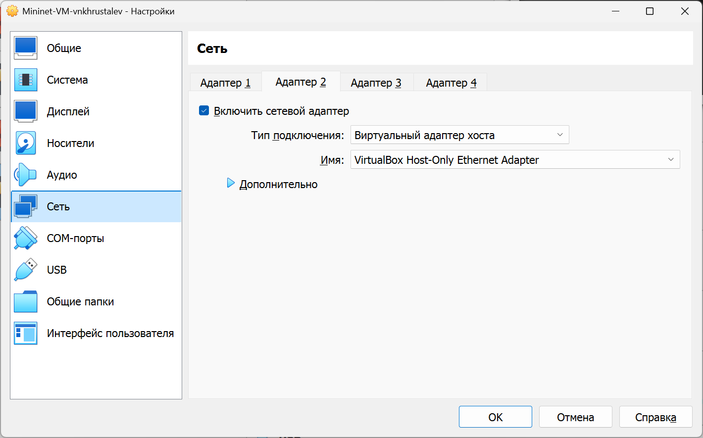
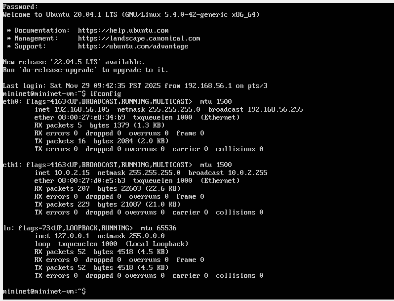
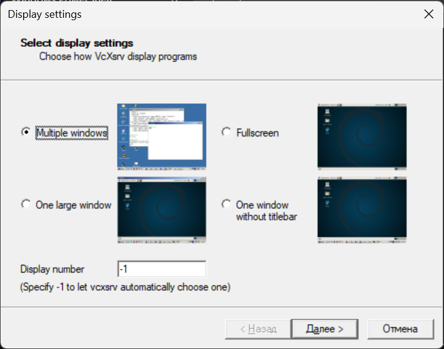
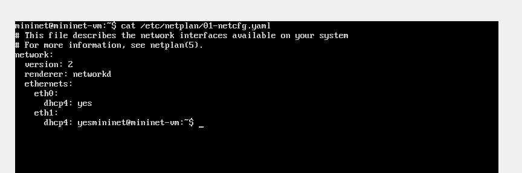
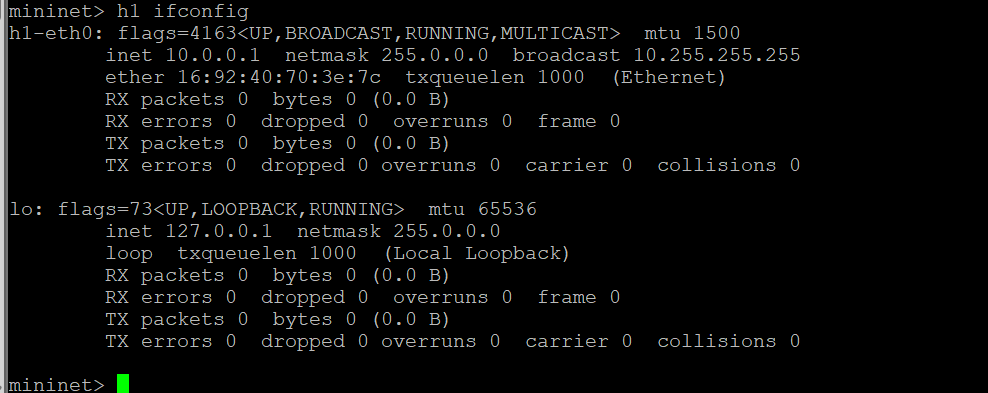
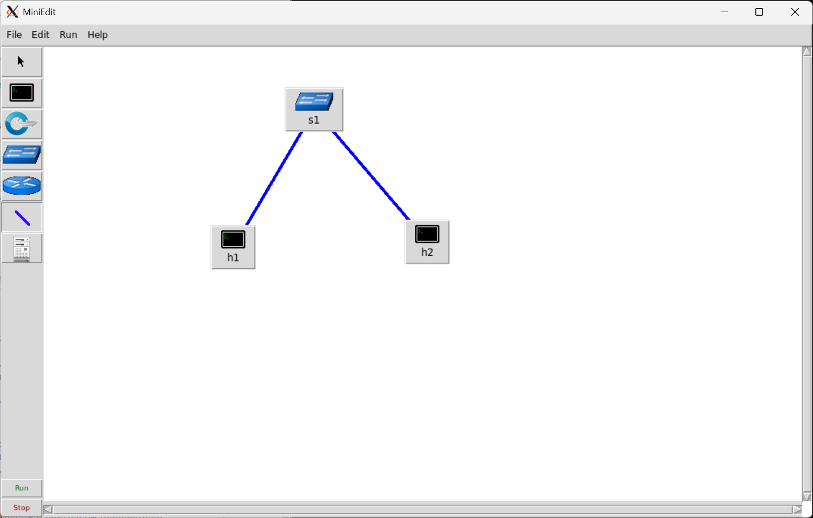
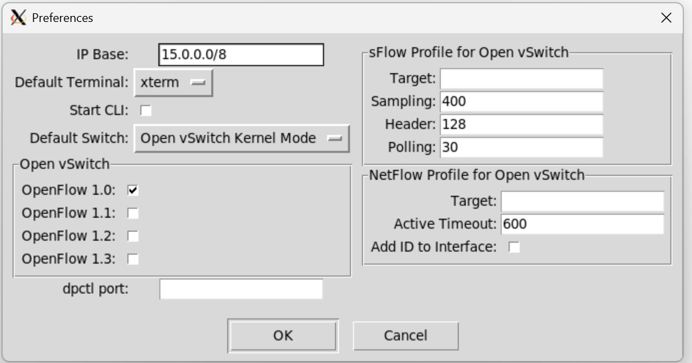
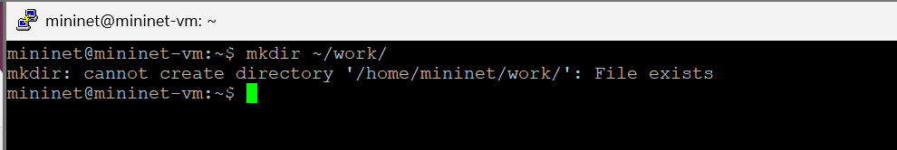
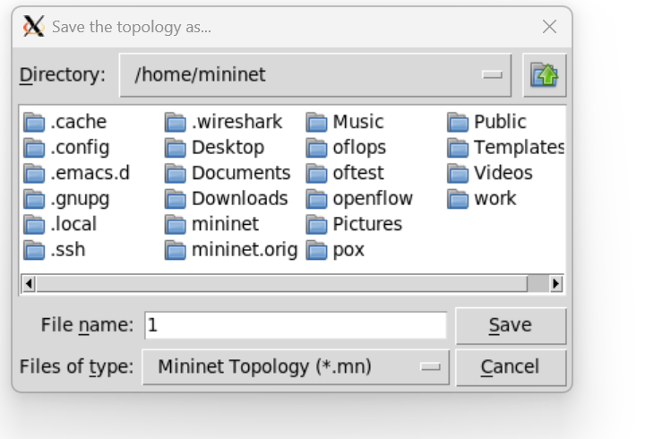
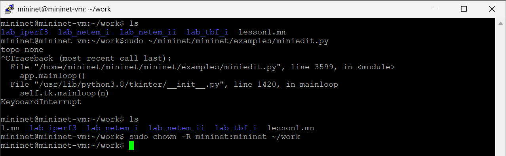

---
## Front matter
lang: ru-RU
title: "Лабораторная работа №1"
subtitle: "Введение в Mininet"
author:
  - Хрусталев В.Н.
institute:
  - Российский университет дружбы народов, Москва, Россия

## i18n babel
babel-lang: russian
babel-otherlangs: english

## Formatting pdf
toc: false
toc-title: Содержание
slide_level: 2
aspectratio: 169
section-titles: true
theme: metropolis
header-includes:
 - \metroset{progressbar=frametitle,sectionpage=progressbar,numbering=fraction}
---

# Информация

## Докладчик

:::::::::::::: {.columns align=center}
::: {.column width="70%"}

  * Хрусталев Влад Николаевич
  * студент
  * Российский университет дружбы народов
  * [1132222011@pfur.ru](mailto:1132222011@pfur.ru)

:::
::: {.column width="25%"}

:::
::::::::::::::

# Цель работы

Основной целью работы является развёртывание в системе виртуализации VirtualBox mininet, знакомство с основными командами для работы с Mininet через командную строку и через графический интерфейс.

# Выполнение лабораторной работы

## Установка и настройка виртуальной машины

{#fig:001 width=85%}

## Вход и просмотр адреса виртуальной машины

{#fig:002 width=85%}

## Подключение к виртуальной машине из терминала хостовой машины

{#fig:003 width=85%}

## Установка putty

{#fig:004 width=85%}

## Установка VcXsrv Windows X Server

{#fig:005 width=85%}

## Запуск и настройка Xserver | Часть 1

{#fig:006 width=85%}

## Запуск и настройка Xserver | Часть 2

{#fig:007 width=85%}

## Запуск и настройка Xserver | Часть 3

{#fig:008 width=85%}

## Запуск и настройка Xserver | Часть 4

{#fig:009 width=85%}

## Опция перенаправления Х11

{#fig:010 width=85%}

## Файл /etc/netplan/01-netcfg.yaml

{#fig:011 width=85%}

## Обновление Mininet

{#fig:012 width=85%}

## Проверка версии Mininet

{#fig:013 width=85%}

## Настройка шрифтов XTerm

{#fig:014 width=85%}

## Настройка соединения X11 для суперпользователя

{#fig:015 width=85%}

## Mininet с использованием топологии по умолчанию

{#fig:016 width=85%}

## Отображение результата help команды

{#fig:017 width=85%}

## Отображение доступных узлов

{#fig:018 width=85%}

## Просмотр доступных линков

{#fig:019 width=85%}

## Команда h1 ifconfig

{#fig:020 width=85%}

## Команда h1 ping 10.0.0.2

{#fig:021 width=85%}

## Очистка предыдущего экземпляра Mininet

{#fig:022 width=85%}

## Добавление двух хостов и одного коммутатора

{#fig:023 width=85%}

## Настройка IP-адреса на хосте h1 и h2

{#fig:024 width=85%}

## Проверка IP-адресов. Пинг

{#fig:025 width=85%}

## Смена базового IP-адреса

{#fig:026 width=85%}

## Просмотр IP-адреса на h1

{#fig:027 width=85%}

## Создание нового каталога

{#fig:028 width=85%}

## Сохранение топологии

{#fig:029 width=85%}

## Изменение прав доступа к файлам в каталоге проекта

{#fig:030 width=85%}

# Выводы

В результате выполнения работы я развёрнул mininet в системе виртуализации VirtualBox и ознакомилась с основными командами для работы с Mininet через командную строку и через графический интерфейс.

# Список литературы

1. Mininet [Электронный ресурс]. Mininet Project Contributors. URL: http://mini
net.org/ (дата обращения: 06.10.2025).

# {.standout}
