---
## Front matter
title: "Лабораторная работа №1"
subtitle: "Дисциплина: Моделирование сетей передачи данных"
author: "Хрусталев Влад Николаевич"

## Generic otions
lang: ru-RU
toc-title: "Содержание"

## Bibliography
bibliography: bib/cite.bib
csl: pandoc/csl/gost-r-7-0-5-2008-numeric.csl

## Pdf output format
toc: true # Table of contents
toc-depth: 2
lof: true # List of figures
lot: false # List of tables
fontsize: 12pt
linestretch: 1.5
papersize: a4
documentclass: scrreprt
## I18n polyglossia
polyglossia-lang:
  name: russian
  options:
	- spelling=modern
	- babelshorthands=true
polyglossia-otherlangs:
  name: english
## I18n babel
babel-lang: russian
babel-otherlangs: english
## Fonts
mainfont: PT Serif
romanfont: PT Serif
sansfont: PT Sans
monofont: PT Mono
mainfontoptions: Ligatures=TeX
romanfontoptions: Ligatures=TeX
sansfontoptions: Ligatures=TeX,Scale=MatchLowercase
monofontoptions: Scale=MatchLowercase,Scale=0.9
## Biblatex
biblatex: true
biblio-style: "gost-numeric"
biblatexoptions:
  - parentracker=true
  - backend=biber
  - hyperref=auto
  - language=auto
  - autolang=other*
  - citestyle=gost-numeric
## Pandoc-crossref LaTeX customization
figureTitle: "Рис."
tableTitle: "Таблица"
listingTitle: "Листинг"
lofTitle: "Список иллюстраций"
lotTitle: "Список таблиц"
lolTitle: "Листинги"
## Misc options
indent: true
header-includes:
  - \usepackage{indentfirst}
  - \usepackage{float} # keep figures where there are in the text
  - \floatplacement{figure}{H} # keep figures where there are in the text
---

# Цель работы

Основной целью работы является развёртывание в системе виртуализации VirtualBox mininet, знакомство с основными командами для работы с Mininet через командную строку и через графический интерфейс.

# Теоретическое введение

Mininet[@mininet] -- это эмулятор компьютерной сети. Под компьютерной сетью подразумеваются простые компьютеры — хосты, коммутаторы, а так же OpenFlow-контроллеры. С помощью простейшего синтаксиса в примитивном интерпретаторе команд можно разворачивать сети из произвольного количества хостов, коммутаторов в различных топологиях и все это в рамках одной виртуальной машины(ВМ). На всех хостах можно изменять сетевую конфигурацию, пользоваться стандартными утилитами(ifconfig, ping) и даже получать доступ к терминалу. На коммутаторы можно добавлять различные правила и маршрутизировать трафик.

# Выполнение работы 

1. Перейдем в репозиторий Mininet, скачаем актуальный релиз ovf-образа виртуальной машины. Запустим систему виртуализации и импортируем файл .ovf и укажем параметры импорт

2. Перейдем в настройки системы виртуализации и уточним параметры настройки виртуальной машины. В частности, для VirtualBox выберем импортированную виртуальную машину и перейдите в меню "Машина -> Настроить".

3. Перейдем к опции «Система». Если внизу этого окна есть сообщение об обнаружении неправильных настроек, то, следуя рекомендациям, внесем исправления (изменим тип графического контроллера на рекомендуемый).

4. В настройках сети первый адаптер должен иметь подключение типа NAT, настроено по умолчанию. Для второго адаптера укажем тип подключения host-only network adapter (виртуальный адаптер хоста), который в дальнейшем мы будем использовать для входа в образ виртуальной машины.(рис. [-@fig:001]):

{ #fig:001 width=85% }

Запустим виртуальную машину с Mininet.
Залогинимся в виртуальную машину:
- login: mininet
- password: mininet

Посмотрим адрес машины с помощью `ifconfig` (рис. [-@fig:002]):

{ #fig:002 width=85% }

Подключимся к виртуальной машине (из терминала хостовой машины). Для отключения ssh-соединения с виртуальной машиной нажмём Ctrl + d (рис. [-@fig:003]):

{ #fig:003 width=85% }

Установим putty (рис. [-@fig:004]) и  VcXsrv Windows X Server (рис. [-@fig:005]):

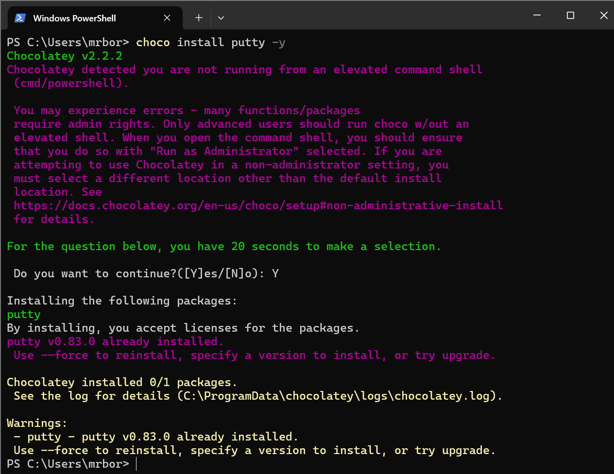{ #fig:004 width=85% }

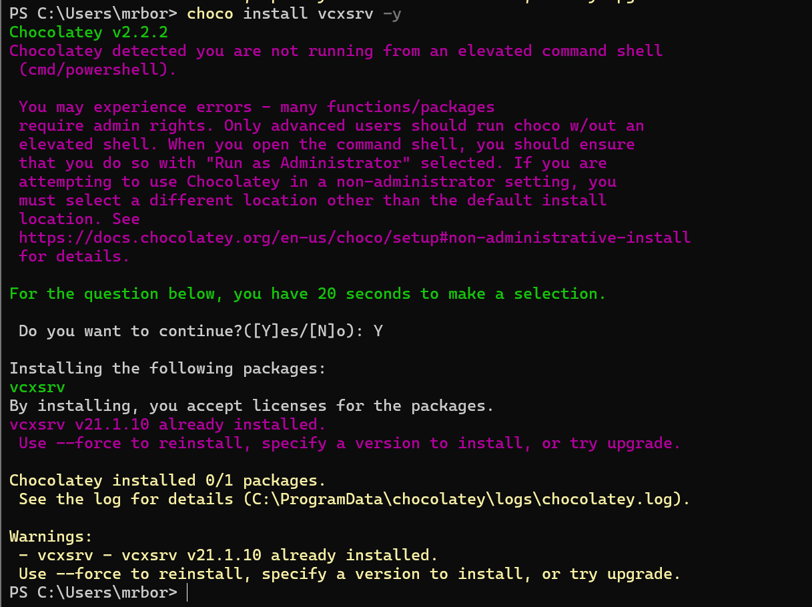{ #fig:005 width=85% }

Запустим Xserver. Выберем опции: multiple windows, display number: -1, start no client. Сохраним 
параметры, тогда при следующем запуске не нужно будет отмечать эти опции.(рис. [-@fig:006]; [-@fig:007]; [-@fig:008]; [-@fig:009]):

{ #fig:006 width=85% }

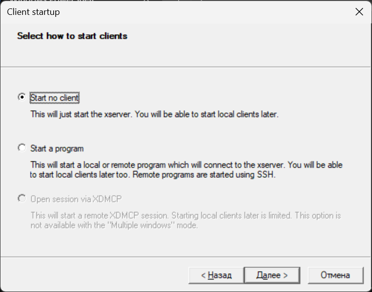{ #fig:007 width=85% }

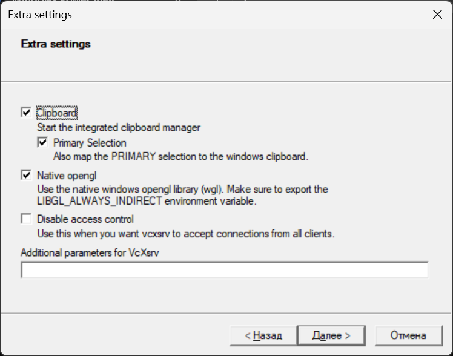{ #fig:008 width=85% }

{ #fig:009 width=85% }

Запустим putty. При подключении добавим опцию перенаправления X11: – Connection SSH X11 : Enable X11 forwarding (рис. [-@fig:010]):

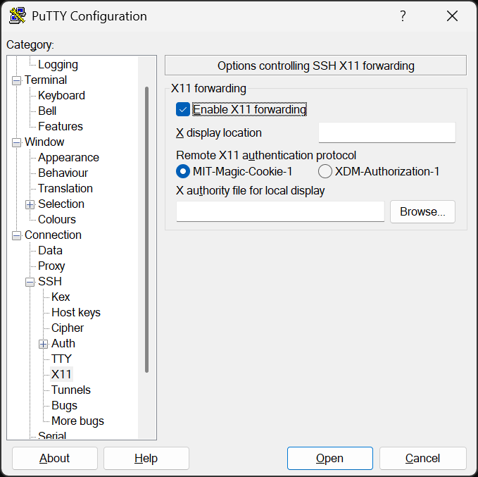{ #fig:010 width=85% }

Для удобства дальнейшей работы добавим для mininet указание на использование двух адаптеров при запуске. Для этого требуется перейти в режим суперпользователя и внести изменения в файл /etc/netplan/01-netcfg.yaml виртуальной машины mininet. В результате файл /etc/netplan/01-netcfg.yaml должен иметь следующий вид(рис. [-@fig:011]):

{ #fig:011 width=85% }

В виртуальной машине mininet переименуем предыдущую установку Mininet. Скачаем новую версию Mininet.
Обновим исполняемые файлы(рис. [-@fig:012]). Проверим номер установленной версии mininet(рис. [-@fig:013]) :

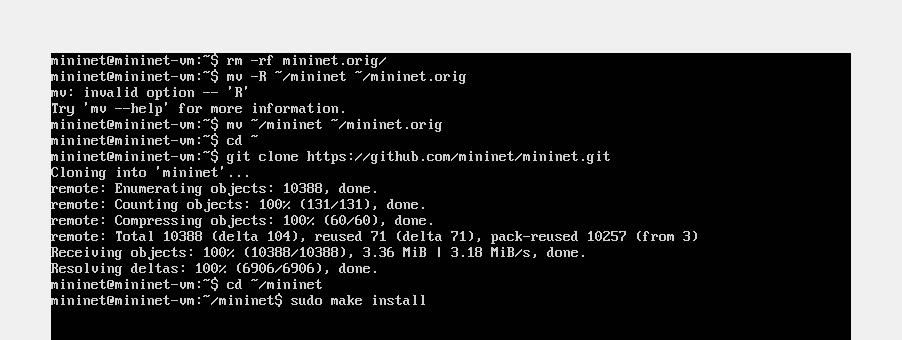{ #fig:012 width=85% }

{ #fig:013 width=85% }

Настроим параметры XTerm для увеличения размера шрифта и применения векторных шрифтов вместо растровых. Внесем изменения в файл `/etc/X11/app-defaults/XTerm` ( рис. [-@fig:014])

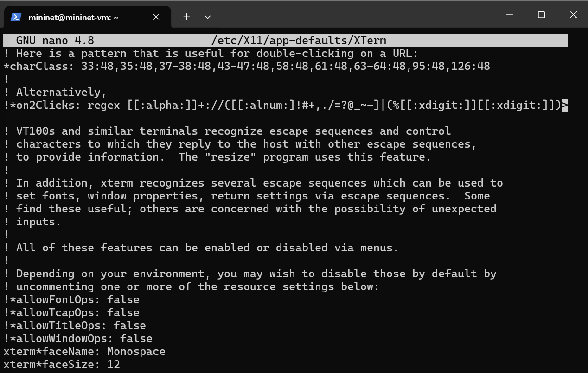{ #fig:014 width=85% }

При попытке запуска приложения из-под суперпользователя возникает ошибка: `X11 connection rejected because of wrong authentication`. Ошибка возникает из-за того, что X-соединение выполняется от имени пользователя mininet, а приложение запускается от имени пользователя root с использованием sudo. Для исправления этой ситуации необходимо заполнить файл полномочий /root/.Xauthority, используя утилиту xauth. Скопируем значение куки (MIT magic cookie)1 пользователя mininet в файл для пользователя root ( рис. [-@fig:015])

{ #fig:015 width=85% }

Запустим минимальную топологию, состоящую из коммутатора, подключённого к двум хостам ( рис. [-@fig:016])

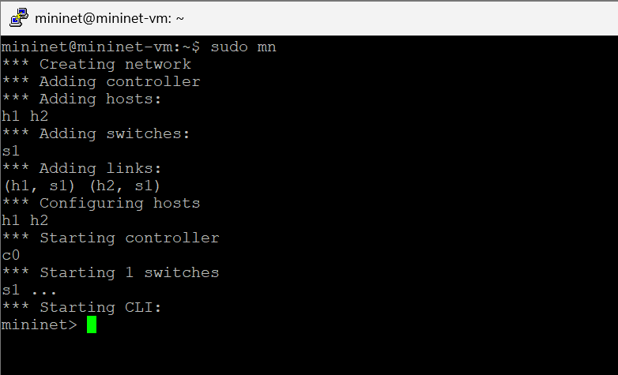{ #fig:016 width=85% }

Для отображения списка команд интерфейса командной строки Mininet и примеров их использования 
введём команду: `help` ( рис. [-@fig:017])

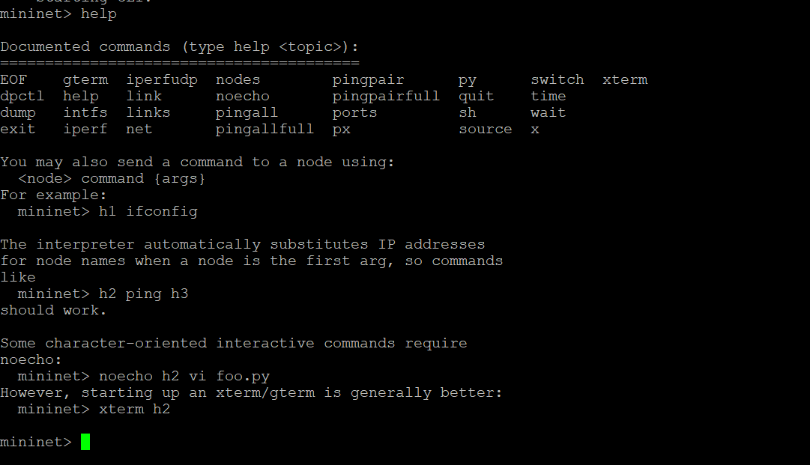{ #fig:017 width=85% }

Для отображения доступных узлов введём: `nodes`. Вывод этой команды показывает, что есть два хоста 
(хост h1 и хост h2) и коммутатор (s1)( рис. [-@fig:018])

{ #fig:018 width=85% }

Иногда бывает полезно отобразить связи между устройствами в Mininet, чтобы понять топологию. 
Введём команду net в интерфейсе командной строки Mininet, чтобы просмотреть доступные линки( рис. [-@fig:019])

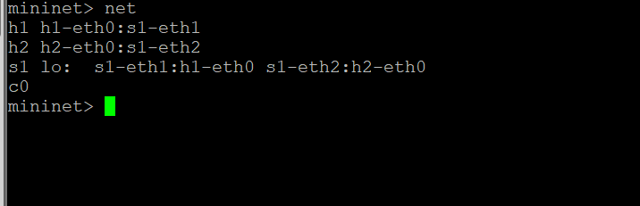{ #fig:019 width=85% }

Вывод этой команды показывает:
- Хост h1 подключён через свой сетевой интерфейс h1-eth0 к коммутатору на интерфейсе s1-eth1.
- Хост h2 подключён через свой сетевой интерфейс h2-eth0 к коммутатору на интерфейсе s1-eth2.
- Коммутатор s1:
  - имеет петлевой интерфейс lo.
  - подключается к h1-eth0 через интерфейс s1-eth1.
  - подключается к h2-eth0 через интерфейс s1-eth2.

Mininet позволяет выполнять команды на конкретном устройстве. Чтобы выполнить команду для определенного узла, необходимо сначала указать устройство, а затем команду, например: `h1 ifconfig`.( рис. [-@fig:020])

{ #fig:020 width=85% }

Эта запись выполняет команду ifconfig на хосте h1 и показывает интерфейсы хоста h1 — хост h1 имеет интерфейс h1-eth0, настроенный с IP-адресом 10.0.0.1, и другой интерфейс lo, настроенный с IP-адресом 127.0.0.1.

По умолчанию узлам h1 и h2 назначаются IP-адреса 10.0.0.1/8 и 10.0.0.2/8 соответственно. Чтобы проверить связь между ними, используем команду `ping`. Команда `ping` работает, отправляя сообщения эхо-запроса протокола управляющих сообщений Интернета (ICMP) на удалённый компьютер и ожидая ответа. Например, команда `h1 ping 10.0.0.2` проверяет соединение между хостами h1 и h2 ( рис. [-@fig:021])

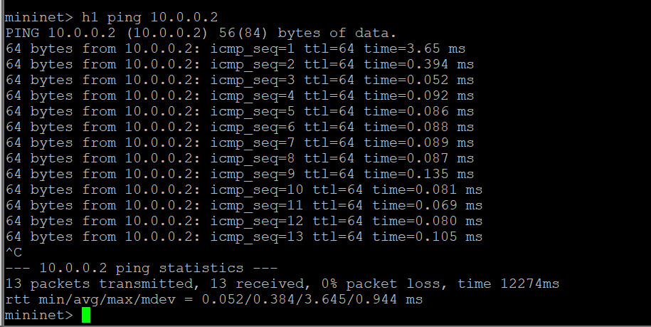{ #fig:021 width=85% }

Очистим предыдущий экземпляр Mininet( рис. [-@fig:022])

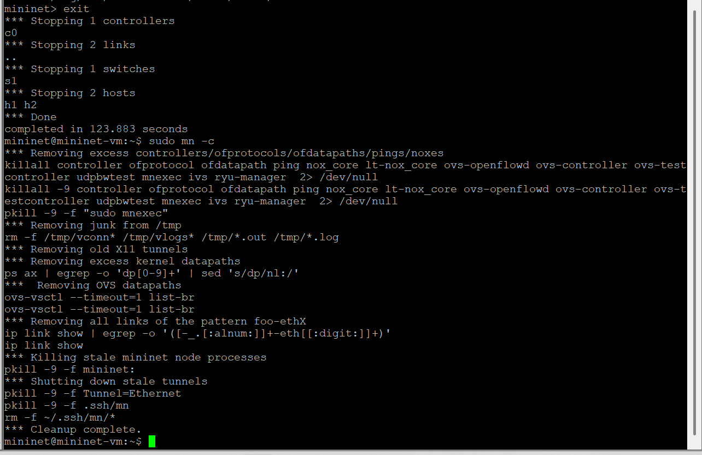{ #fig:022 width=85% }

В терминале виртуальной машины mininet запустим MiniEdit: `sudo ~/mininet/mininet/examples/miniedit.py`.

Основные кнопки:
- Select: позволяет выбирать/перемещать устройства. Нажатие Del на клавиатуре после выбора устройства удаляет его из топологии.
- Host: позволяет добавить новый хост в топологию. После нажатия этой кнопки щелкните в любом месте пустого холста, чтобы вставить новый хост.
- Switch: позволяет добавить в топологию новый коммутатор. После нажатия этой кнопки щёлкните в любом месте пустого холста, чтобы вставить переключатель.
- Link: соединяет устройства в топологии. После нажатия этой кнопки щелкните устройство и перетащите его на второе устройство, с которым необходимо установить связь.
- Run: запускает эмуляцию. После проектирования и настройки топологии нажмите кнопку запуска.
- Stop: останавливает эмуляцию.

Добавим два хоста и один коммутатор, соединим хосты с коммутатором.( рис. [-@fig:023])

{ #fig:023 width=85% }

Настроим IP-адреса на хостах h1 и h2. Для этого удерживая правую кнопку мыши на устройстве выберем свойства. Для хоста h1 укажем IP-адрес `10.0.0.1/8`, а для хоста h2 — `10.0.0.2/8`.( рис. [-@fig:024])

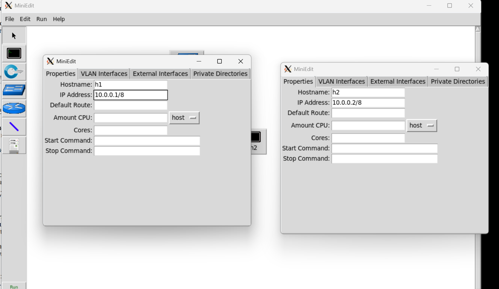{ #fig:024 width=85% }

Перед проверкой соединения между хостом h1 и хостом h2 необходимо запустить эмуляцию. Для запуска эмуляции нажмем кнопку Run. После начала эмуляции кнопки панели MiniEdit станут серыми, указывая на то, что в настоящее время они отключены.

Откроем терминал на хосте h1, удерживая правую кнопку мыши на хосте h1 и выбрав Terminal. Это действие позволит выполнять команды на хосте h1. Откроем терминал на хосте h2. На терминале хоста h1 введем команду ifconfig, чтобы отобразить назначенные ему IP-адреса. Интерфейс h1-eth0 на хосте h1 настроен с IP-адресом 10.0.0.1 и маской подсети 255.0.0.0. Повторим эти действия на хосте h2. Его интерфейс h2-eth0 настроен с IP-адресом 10.0.0.2 и маской подсети 255.0.0.0. Проверим соединение между хостами, введя в терминале хоста h1 команду `ping 10.0.0.2`. Для остановки теста нажмем `Ctrl + c`. Остановим эмуляцию, нажав кнопку Stop.( рис. [-@fig:025])

{ #fig:025 width=85% }

Ранее IP-адреса узлам h1 и h2 были назначены вручную. В качестве альтернативы можно полагаться на Mininet для автоматического назначения IP-адресов.

Удалим назначенный вручную IP-адрес с хостов h1 и h2. В MiniEdit нажмем Edit Preferences . По умолчанию в поле базовые значения IP-адресов (IP Base) установлено 10.0.0.0/8. Изменим это значение на 15.0.0.0/8 ( рис. [-@fig:026])

{ #fig:026 width=85% }

Запустим эмуляцию, нажав кнопку Run. Откроем терминал на хосте h1, удерживая правую кнопку мыши на хосте
h1 и выбрав Terminal. Чтобы отобразить IP-адреса, назначенные хосту h1, введем команду `ifconfig`. Интерфейс h1-eth0 на узле h1 теперь имеет IP-адрес 15.0.0.1 и маску подсети 255.0.0.0. Проверим IP-адрес, назначенный хосту h2. Соответствующий интерфейс h2-eth0 на хосте h2 имеет IP-адрес 15.0.0.2 и маску подсети 255.0.0.0( рис. [-@fig:027])

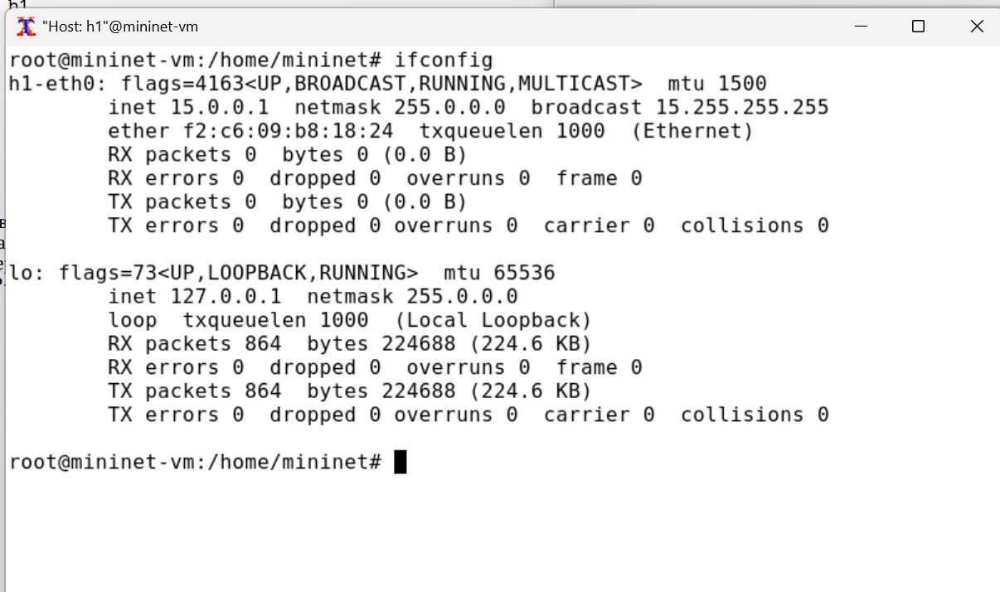{ #fig:027 width=85% }

Остановим эмуляцию, нажав кнопку Stop.

В домашнем каталоге виртуальной машины mininet создадим каталог для работы с проектами mininet: `mkdir ~/work`.( рис. [-@fig:028])

{ #fig:028 width=85% }

Для сохранения топологии сети в файл нажмем в MiniEdit File Save. Укажем имя для топологии и сохраним на своём компьютере.( рис. [-@fig:029])

{ #fig:029 width=85% } 

После сохранения проекта поменяем права доступа к файлам в каталоге проекта: `sudo chown -R mininet:mininet ~/work`. Для загрузки топологии в MiniEdit нажмем File Open( рис. [-@fig:030])

{ #fig:030 width=85% } 

# Выводы

В результате выполнения работы я развёрнул mininet в системе виртуализации VirtualBox и ознакомилась с основными командами для работы с Mininet через командную строку и через графический интерфейс.

# Список литературы{.unnumbered}

::: {#refs}
:::