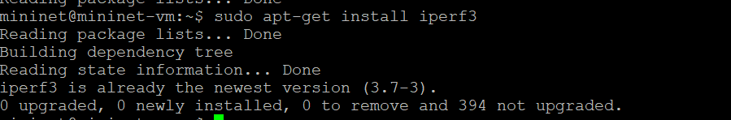
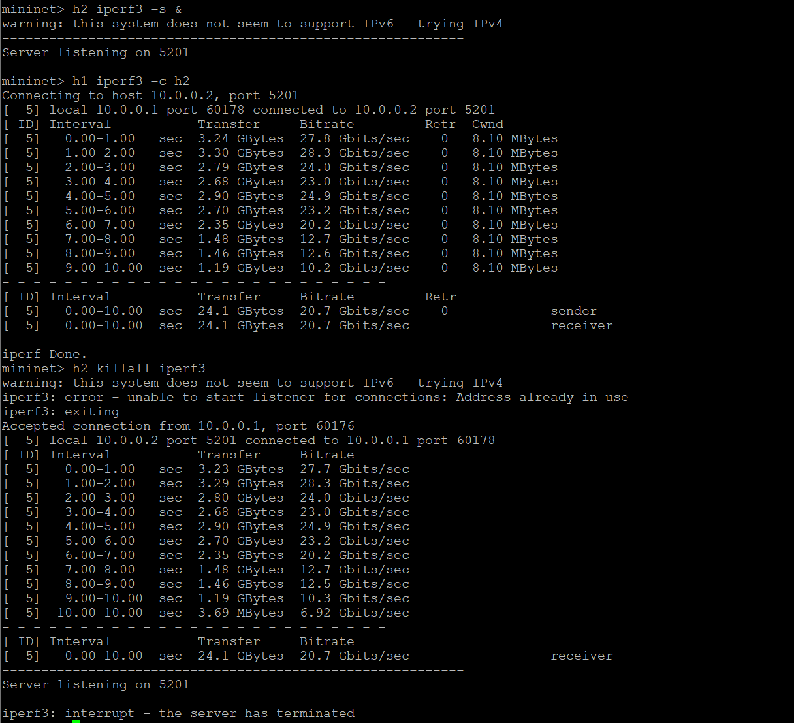
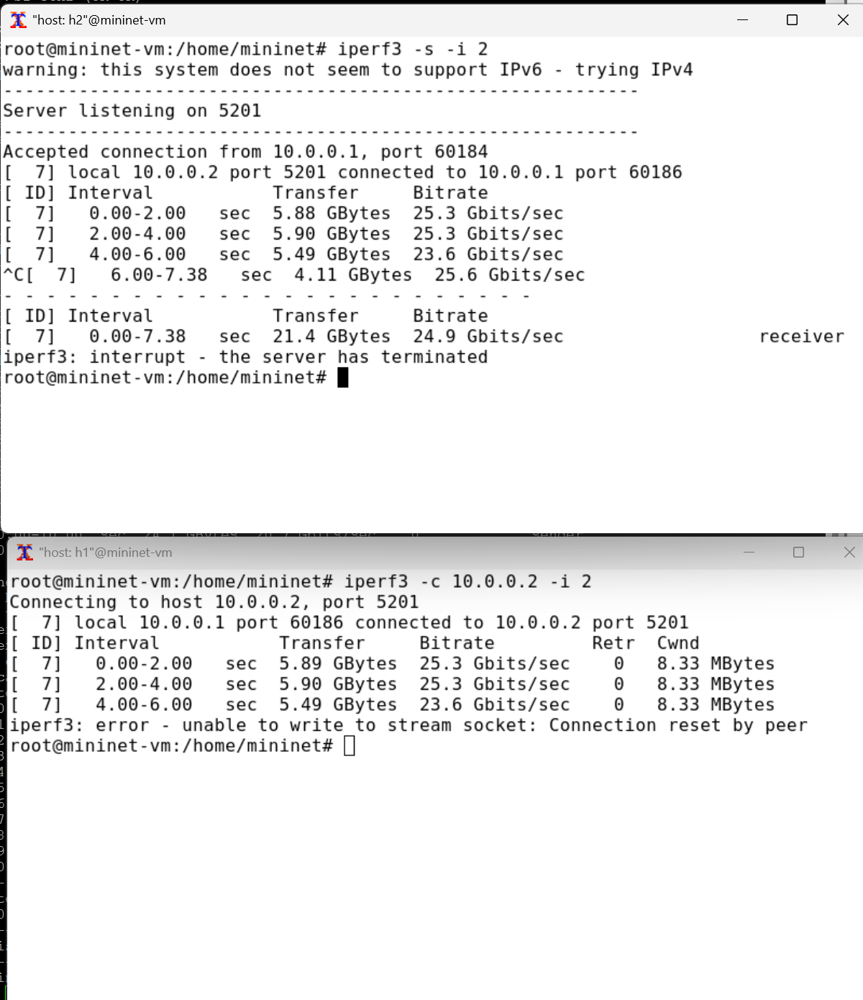
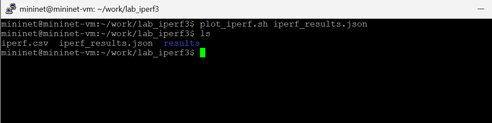
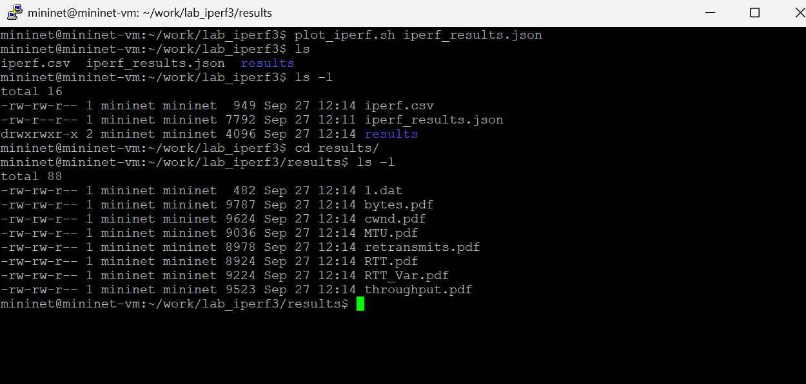

---
## Front matter
lang: ru-RU
title: "Лабораторная работа №2"
subtitle: "Моделирование сетей передачи данных"
author:
  - Хрусталев В.Н.
institute:
  - Российский университет дружбы народов, Москва, Россия

## i18n babel
babel-lang: russian
babel-otherlangs: english

## Formatting pdf
toc: false
toc-title: Содержание
slide_level: 2
aspectratio: 169
section-titles: true
theme: metropolis
header-includes:
 - \metroset{progressbar=frametitle,sectionpage=progressbar,numbering=fraction}
---

# Информация

## Докладчик

:::::::::::::: {.columns align=center}
::: {.column width="70%"}

  * Хрусталев Влад Николаевич
  * студент
  * Российский университет дружбы народов
  * [1132222011@pfur.ru](mailto:1132222011@pfur.ru)

:::
::: {.column width="25%"}

:::
::::::::::::::

# Цель работы

Основной целью работы является знакомство с инструментом для
измерения пропускной способности сети в режиме реального времени —
iPerf3, а также получение навыков проведения интерактивного эксперимента
по измерению пропускной способности моделируемой сети в среде Mininet.

# Выполнение лабораторной работы

## Активация и подключение по ssh к mininet

{#fig:001 width=70%}

## Проверка обновлений ПО

{#fig:002 width=70%}

## Установка iperf3

{#fig:003 width=70%}

## Установка необходимого ПО

{#fig:004 width=70%}

## Развертывание iperf3_plotter

{#fig:005 width=70%}

## Задание простейшей топологии. Параметры

{#fig:006 width=70%}

## Тестовое соединение между хостами

{#fig:008 width=70%}

## Эксперимент в интерфейсе mininet

{#fig:009 width=70%}

## Тест с указанием периода времени передачи

{#fig:010 width=70%}

## Тест с указанием пропускной способности с 2-секундным интервалом

{#fig:011 width=70%}

## Задание в тесте определённого объёма данных

{#fig:012 width=70%}

## Тест с изменённым протоколом передачи данных

{#fig:013 width=70%}

## Тест с изменённым номером порта для отправки/получения пакетов

{#fig:014 width=70%}

## Тест с параметром обработки данных только от одного клиента с остановкой сервера по завершении теста

{#fig:015 width=70%}

## Создание директории для результатов iperf3

{#fig:016 width=70%}

## Тест с сохранением в файл в формате json

{#fig:017 width=70%}

## Проверка создания файла iperf_results.json

{#fig:018 width=70%}

## Конец эмуляции

{#fig:019 width=70%}

## Исправление прав запуска X-соединения

{#fig:020 width=70%}

## Визуализация результатов эксперимента (1/3)

{#fig:021 width=70%}

## Визуализация результатов эксперимента (2/3)

{#fig:022 width=70%}

## Визуализация результатов эксперимента (3/3)

{#fig:023 width=70%}

# Выводы

В результате выполнения лабораторной работы я познакомился с инструментом для измерения пропускной способности сети в режиме реального времени — iPerf3, и приобрёл навыки проведения эксперемента в моделируемой сети среды Mininet по измерению пропускной способности сети.

# Список литературы

1. Mininet [Электронный ресурс]. Mininet Project Contributors. URL: http://mininet.org/ (дата обращения: 27.09.2025).

1. iPerf3 [Электронный ресурс]. URL: http://iperf,fr/ (дата обращения: 27.09.2025).

# {.standout}
