---
## Front matter
title: "Лабораторная работа №2"
subtitle: "Моделирование сетей передачи данных"
author: "Хрусталев Влад Николаевич"

## Generic otions
lang: ru-RU
toc-title: "Содержание"

## Bibliography
bibliography: bib/cite.bib
csl: pandoc/csl/gost-r-7-0-5-2008-numeric.csl

## Pdf output format
toc: true # Table of contents
toc-depth: 2
lof: true # List of figures
lot: false # List of tables
fontsize: 12pt
linestretch: 1.5
papersize: a4
documentclass: scrreprt
## I18n polyglossia
polyglossia-lang:
  name: russian
  options:
	- spelling=modern
	- babelshorthands=true
polyglossia-otherlangs:
  name: english
## I18n babel
babel-lang: russian
babel-otherlangs: english
## Fonts
mainfont: PT Serif
romanfont: PT Serif
sansfont: PT Sans
monofont: PT Mono
mainfontoptions: Ligatures=TeX
romanfontoptions: Ligatures=TeX
sansfontoptions: Ligatures=TeX,Scale=MatchLowercase
monofontoptions: Scale=MatchLowercase,Scale=0.9
## Biblatex
biblatex: true
biblio-style: "gost-numeric"
biblatexoptions:
  - parentracker=true
  - backend=biber
  - hyperref=auto
  - language=auto
  - autolang=other*
  - citestyle=gost-numeric
## Pandoc-crossref LaTeX customization
figureTitle: "Рис."
tableTitle: "Таблица"
listingTitle: "Листинг"
lofTitle: "Список иллюстраций"
lotTitle: "Список таблиц"
lolTitle: "Листинги"
## Misc options
indent: true
header-includes:
  - \usepackage{indentfirst}
  - \usepackage{float} # keep figures where there are in the text
  - \floatplacement{figure}{H} # keep figures where there are in the text
---

# Цель работы

Основной целью работы является знакомство с инструментом для
измерения пропускной способности сети в режиме реального времени —
iPerf3, а также получение навыков проведения интерактивного эксперимента
по измерению пропускной способности моделируемой сети в среде Mininet.

# Теоретическое введение

Mininet[@mininet] -- это эмулятор компьютерной сети. Под компьютерной сетью подразумеваются простые компьютеры — хосты, коммутаторы, а так же OpenFlow-контроллеры. С помощью простейшего синтаксиса в примитивном интерпретаторе команд можно разворачивать сети из произвольного количества хостов, коммутаторов в различных топологиях и все это в рамках одной виртуальной машины(ВМ). На всех хостах можно изменять сетевую конфигурацию, пользоваться стандартными утилитами(ifconfig, ping) и даже получать доступ к терминалу. На коммутаторы можно добавлять различные правила и маршрутизировать трафик.

iPerf3[@iperf] представляет собой кроссплатформенное клиент-серверное приложение с открытым исходным кодом, которое можно использовать для измерения пропускной способности между двумя конечными устройствами. iPerf3 может работать с транспортными протоколами TCP, UDP и SCTP:
- TCP и SCTP:
  - измеряет пропускную способность;
  - позволяет задать размер MSS/MTU;
  - отслеживает размер окна перегрузки TCP (CWnd).
- UDP:
  - измеряет пропускную способность;
  - измеряет потери пакетов;
  - измеряет колебания задержки (jitter);
  - поддерживает групповую рассылку пакетов (multicast).

# Задание 

1. Установить на виртуальную машину mininet iPerf3 и дополнительное программное обеспечения для визуализации и обработки данных.

2.Провести ряд интерактивных экспериментов по измерению пропускной
способности с помощью iPerf3 с построением графиков.

# Выполнение лабораторной работы

Запустим виртуальную среду с mininet. Из основной Oc подключимся к машине по ssh(putty). Подключим eth1. (рис. [-@fig:001].

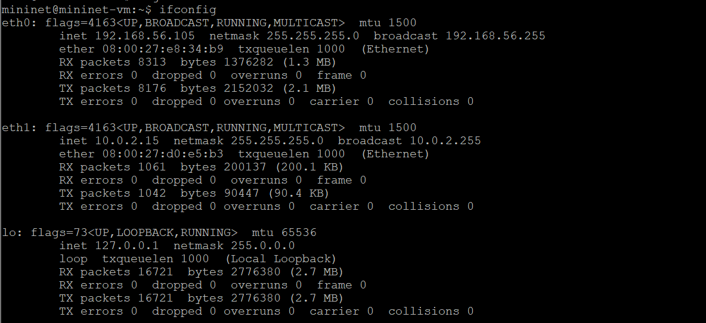{#fig:001 width=70%}

Обновим репозитории программного обеспечения на виртуальной машине(рис. [-@fig:002]). Установим iperf3 (рис. [-@fig:003]) и необходимое дополнительное программное обеспечение (рис. [-@fig:004]) на виртуальную машину. Развернем iperf3_plotter (рис. [-@fig:005]).

{#fig:002 width=70%}

{#fig:003 width=70%}

{#fig:004 width=70%}

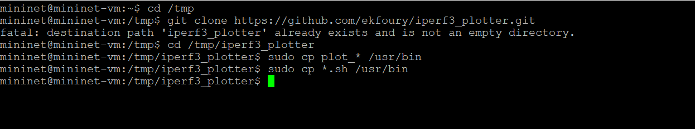{#fig:005 width=70%}

Зададим простейшую топологию, состоящую из двух хостов и коммутатора с назначенной по умолчанию mininet сетью 10.0.0.0/8.
После введения этой команды запустятся терминалы двух хостов, коммутатора и контроллера. Терминалы коммутатора и контроллера закроем. В терминале виртуальной машины посмотрим параметры запущенной в интерактивном режиме топологии (рис. [-@fig:006]).

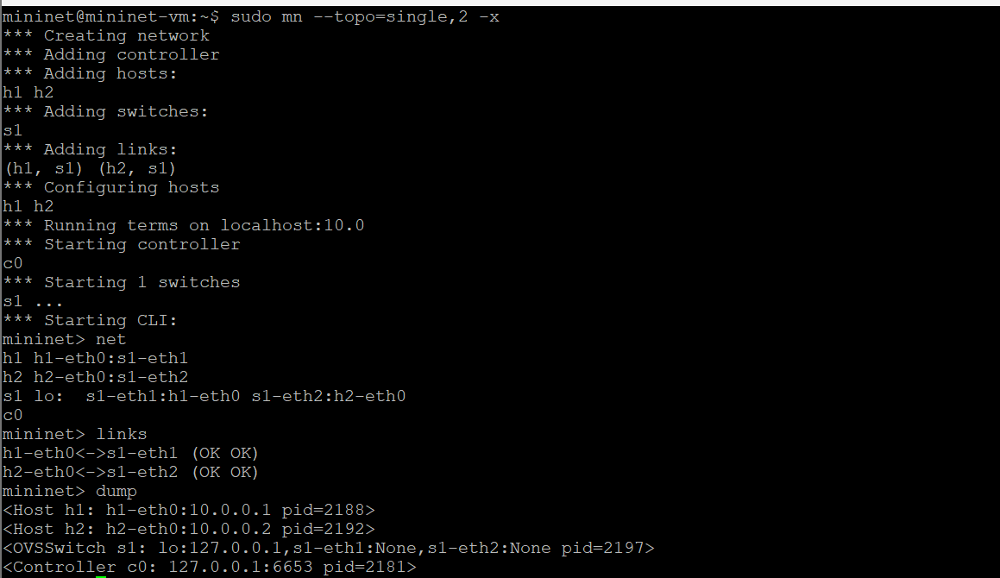{#fig:006 width=70%}

Проведем простейший интерактивный эксперимент по измерению пропускной способности с помощью iPerf3 (рис. [-@fig:008]).

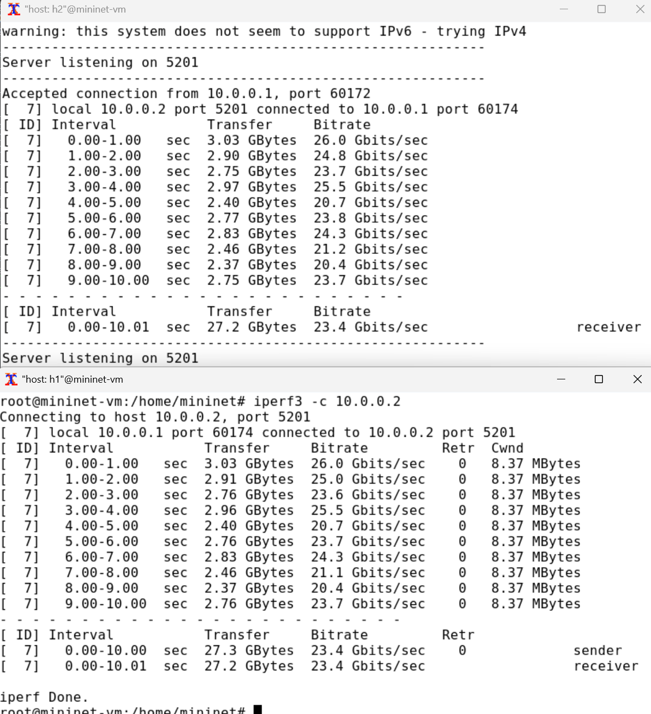{#fig:008 width=70%}

Проанализируем полученный в результате выполнения теста сводный отчёт, отобразившийся как на клиенте, так и на сервере iPerf3. Он содержет следующие данные:

- ID: идентификационный номер соединения -- 7.
- интервал (Interval): временной интервал для периодических отчетов о пропускной способности (по умолчанию временной интервал равен 1 секунде);
- передача (Transfer): сколько данных было передано за каждый интервал времени -- было пепредано от 2.37 до 3.03 GB в секунду;
- пропускная способность (Bitrate): измеренная пропускная способность в каждом временном интервале -- от 20.4 до 26.0 Gbit/sec;
- Retr: количество повторно переданных TCP-сегментов за каждый временной интервал (это поле увеличивается, когда TCP-сегменты теряются в сети из-за перегрузки или повреждения) -- чем больше пропускная способность, тем больше число повторно переданных  TCP-сегментов. Равен 0;
- Cwnd: указывает размер окна перегрузки в каждом временном интервале (TCP использует эту переменную для ограничения объёма данных, которые TCP-клиент может отправить до получения подтверждения отправленных данных) -- стабильно  8.37 MB.

Проведем аналогичный эксперимент в интерфейсе mininet. Сравним результаты. Увидим, что во втором случае было передано на ~3гб меньше и пропускная спобгность так же уменьшилась на ~3гб; потерь нет. После этого завершим(убьём) процесс (рис. [-@fig:009]).

{#fig:009 width=70%}

Для указания iPerf3 периода времени для передачи можно использовать ключ -t (или --time) — время в секундах для передачи (по умолчанию 10 секунд)(рис. [-@fig:010]).

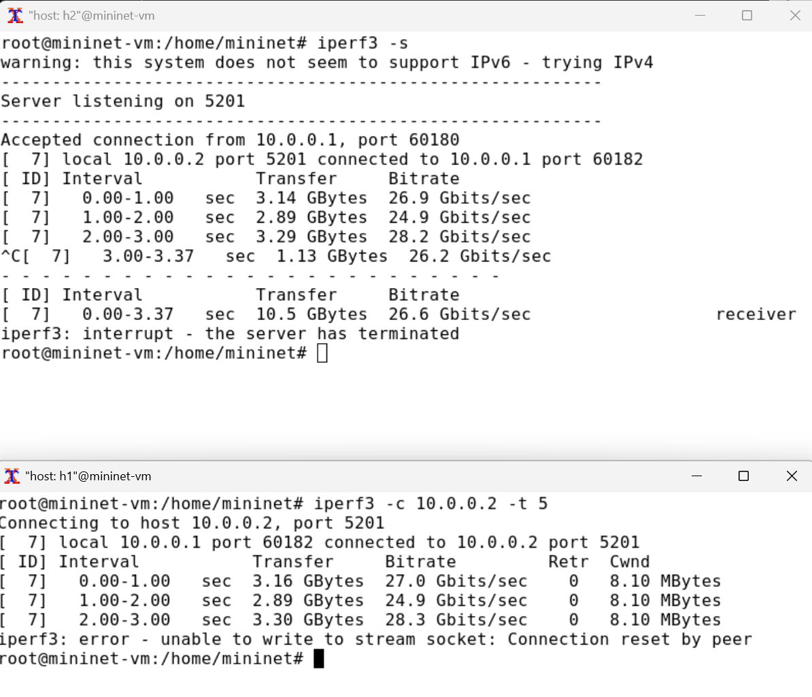{#fig:010 width=70%}

Настроем клиент iPerf3 для выполнения теста пропускной способности с 2-секундным интервалом времени отсчёта как на клиенте, так и на сервере. Используем опцию `-i` для установки интервала между отсчётами, измеряемого в секундах (рис. [-@fig:011]).

{#fig:011 width=70%}

Как мы видим, интервал увеличился в два раза, аналогично в 2 раза увеличился объем передаваемой информации за один интервал времени, но остальные значение практически не изменились, в допустимой погрешности.

Зададим на клиенте iPerf3 отправку определённого объёма данных. Используем опцию `-n` для установки количества байт для передачи (рис. [-@fig:012]).

По умолчанию iPerf3 выполняет измерение пропускной способности в течение 10 секунд, но при задании количества
данных для передачи клиент iPerf3 будет продолжать отправлять пакеты до тех пор, пока не будет отправлен весь объем данных, указанный
пользователем.

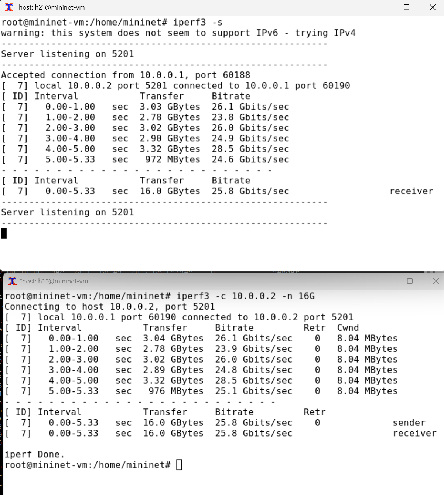{#fig:012 width=70%}

Изменим в тесте измерения пропускной способности iPerf3 протокол передачи данных с TCP (установлен по умолчанию) на UDP. iPerf3 автоматически определяет протокол транспортного уровня на стороне сервера. Для изменения протокола используем опцию `-u` на стороне клиента iPerf3 (рис. [-@fig:013]).

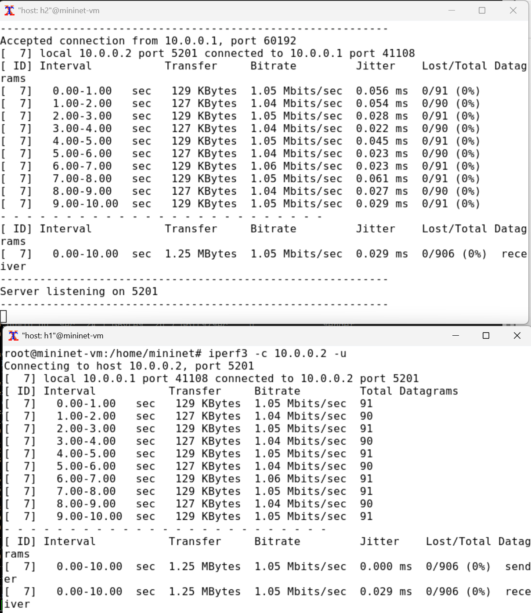{#fig:013 width=70%}

В тесте измерения пропускной способности iPerf3 изменим номер порта для отправки/получения пакетов или датаграмм через указанный порт (рис. [-@fig:014]).

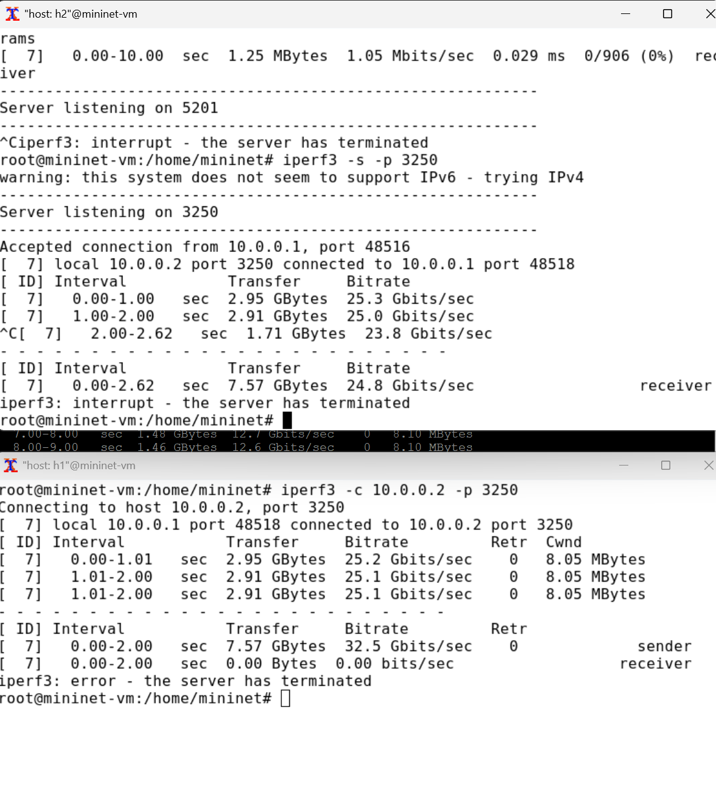{#fig:014 width=70%}

По умолчанию после запуска сервер iPerf3 постоянно прослушивает входящие соединения. В тесте измерения пропускной способности iPerf3 зададим для сервера параметр обработки данных только от одного клиента с остановкой сервера по завершении теста. Для этого используем опцию `-1` на сервере iPerf3 (рис. [-@fig:015]).

После завершения этого теста сервер iPerf3 немедленно останавливается.

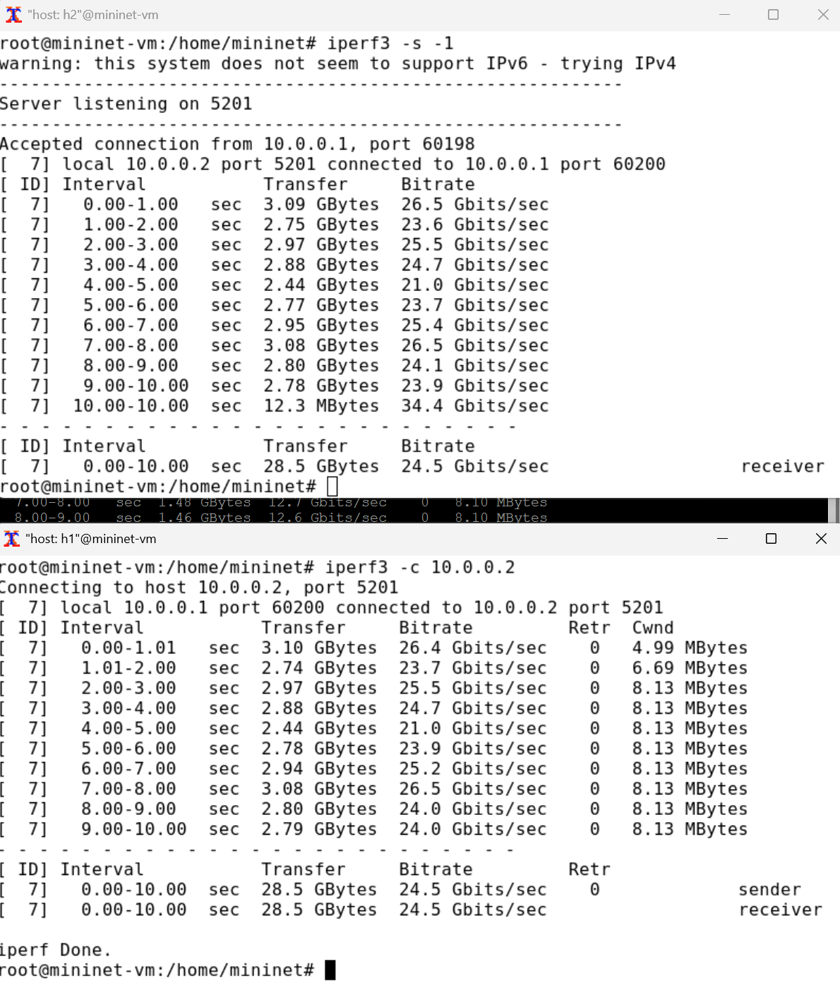{#fig:015 width=70%}

Экспортируем результаты теста измерения пропускной способности iPerf3 в файл JSON. Для начала создадим дирректорию куда будем сохранять файл (рис. [-@fig:016]). После чего запустим тест с сохраннием в файл в созданной дирректории (рис. [-@fig:017]).

{#fig:016 width=70%}. 

{#fig:017 width=70%}. 

Убедимся, что файл iperf_results.json создан в указанном каталоге. Для этого в терминале ВМ введем следующие команды (рис. [-@fig:018]).

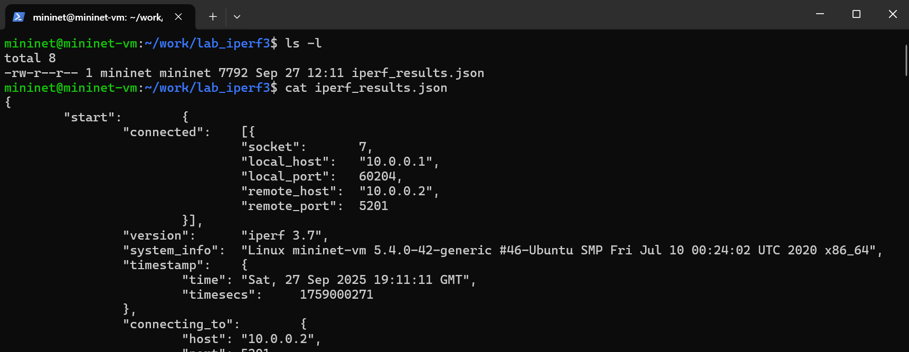{#fig:018 width=70%}. 

Завершим симуляцию (рис. [-@fig:019]).

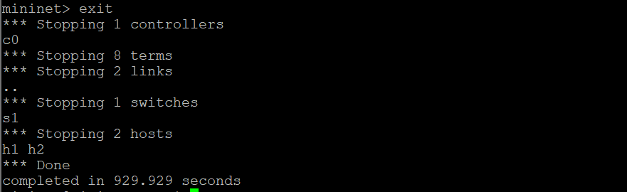{#fig:019 width=70%}. 

В виртуальной машине mininet исправим права запуска X-соединения.
Скопируем значение куки (MIT magic cookie) своего пользователя mininet в файл для пользователя root (рис. [-@fig:020]).

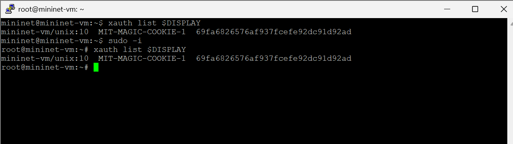{#fig:020 width=70%}. 

Визуализируем результаты эксперимента. В виртуальной машине mininet перейдем в каталог для работы над проектом, проверим права доступа к файлу JSON(рис. [-@fig:021]). Сгенерируем выходные данные для файла JSON iPerf3(рис. [-@fig:022]). Убедимся, что файлы с данными и графиками сформировались(рис. [-@fig:023]).

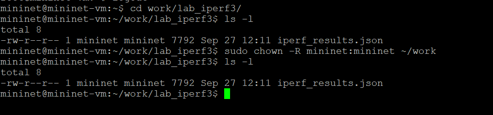{#fig:021 width=70%}.

{#fig:022 width=70%}.

{#fig:023 width=70%}.

# Выводы

В результате выполнения лабораторной работы я познакомился с инструментом для измерения пропускной способности сети в режиме реального времени — iPerf3, и приобрёл навыки проведения эксперемента в моделируемой сети среды Mininet по измерению пропускной способности сети.

# Список литературы{.unnumbered}

::: {#refs}
:::