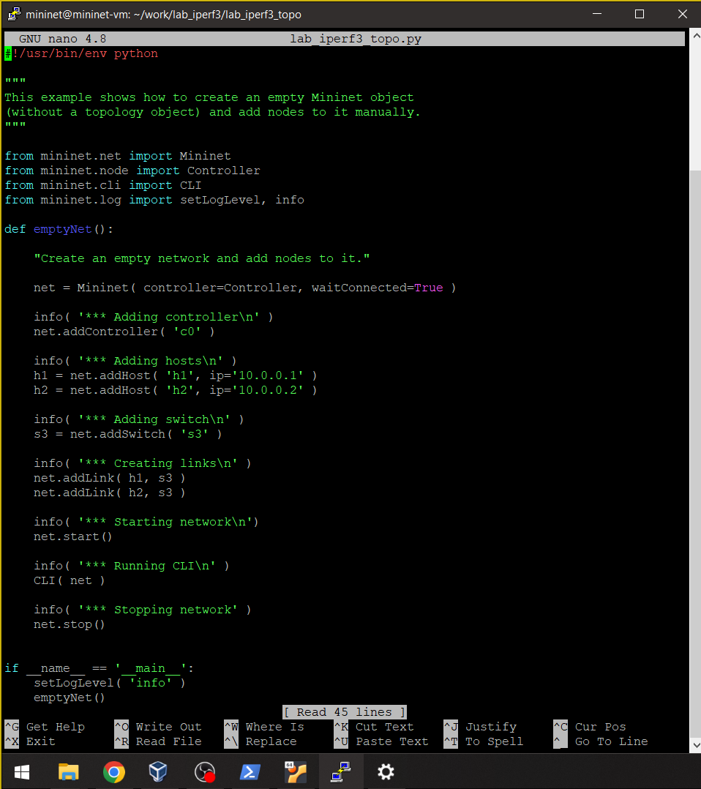
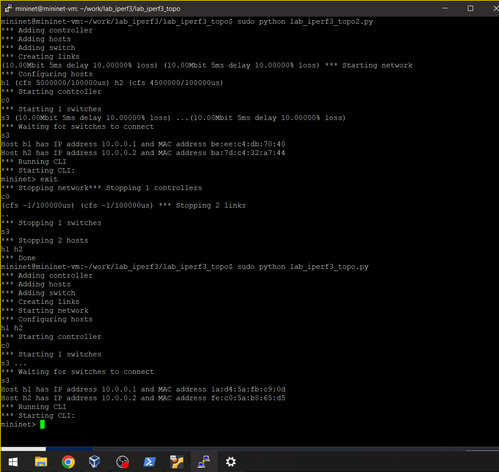
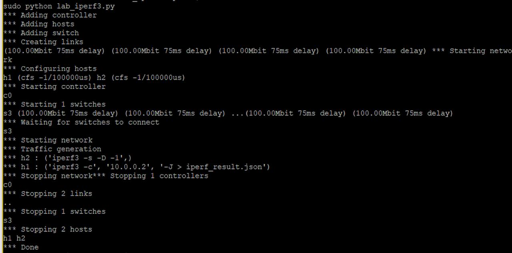

---
## Front matter
lang: ru-RU
title: "Лабораторная работа №3"
subtitle: "Измерение и тестирование пропускной способности сети. Воспроизводимый эксперимент"
author:
  - Хрусталев В.Н.
institute:
  - Российский университет дружбы народов, Москва, Россия

## i18n babel
babel-lang: russian
babel-otherlangs: english

## Formatting pdf
toc: false
toc-title: Содержание
slide_level: 2
aspectratio: 169
section-titles: true
theme: metropolis
header-includes:
 - \metroset{progressbar=frametitle,sectionpage=progressbar,numbering=fraction}
---

# Информация

## Докладчик

:::::::::::::: {.columns align=center}
::: {.column width="70%"}

  * Хрусталев Влад Николаевич
  * студент
  * Российский университет дружбы народов
  * [1132222011@pfur.ru](mailto:1132222011@pfur.ru)

:::
::: {.column width="25%"}

:::
::::::::::::::

# Цель работы

Основной целью работы является знакомство с инструментом для измерения
пропускной способности сети в режиме реального времени — iPerf3, а также
получение навыков проведения воспроизводимого эксперимента по измерению
пропускной способности моделируемой сети в среде Mininet.

# Выполнение лабораторной работы

## Создание подкаталога, копирование файла с примером скрипта (описывающего стандартную простую топологию сети mininet)

{#fig:001 width=70%}

## Содержание файла lab_iperf3_topo.py

{#fig:002 width=70%}

## Запуск скрипта создания топологии и дальнейший просмотр элементов

{#fig:003 width=70%}

## Внесение изменения в скрипт, позволяющего вывести на экран информацию о хостах h1 и h2 (имя, IP-адрес, MAC-адрес)

{#fig:004 width=70%}

## Проверка корректности отработки скрипта

{#fig:005 width=70%}

## Настройка параметров производительности

{#fig:006 width=70%}

## Запуск скрипта с настройкой параметров производительности и без нее

{#fig:007 width=70%}

## Создание копии скрипта lab_iperf3_topo2.py

{#fig:008 width=70%}

## Изменения кода в скрипте lab_iperf3.py

{#fig:009 width=70%}

## Запуск скрипта lab_iperf3.py

{#fig:010 width=70%}

## Создание Makefile

{#fig:011 width=70%}

## Проверка работы Makefile

{#fig:012 width=70%}

# Выводы

В ходе выполнения лабораторной работы я познакомился с инструментом для измерения
пропускной способности сети в режиме реального времени — iPerf3, а также
получение навыков проведения интерактивного эксперимента по измерению
пропускной способности моделируемой сети в среде Mininet.

# Список литературы

1. Mininet [Электронный ресурс]. Mininet Project Contributors. URL: http://mini
net.org/ (дата обращения: 06.10.2025).

# {.standout}
