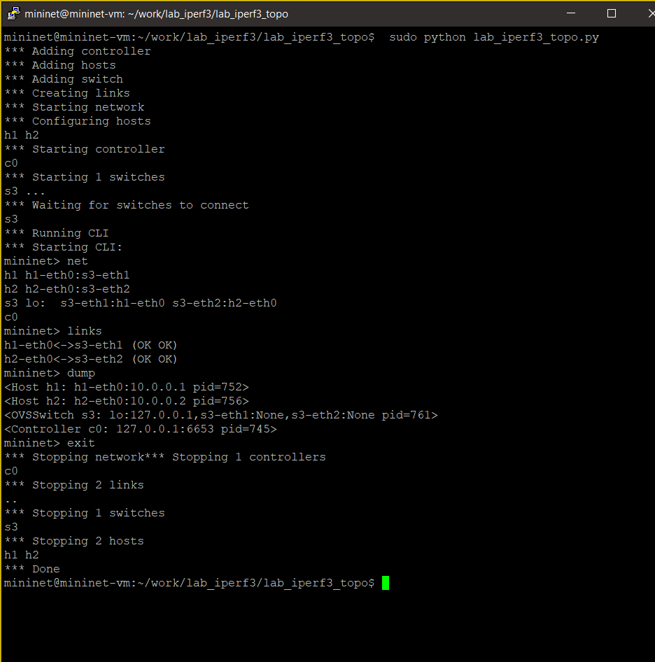
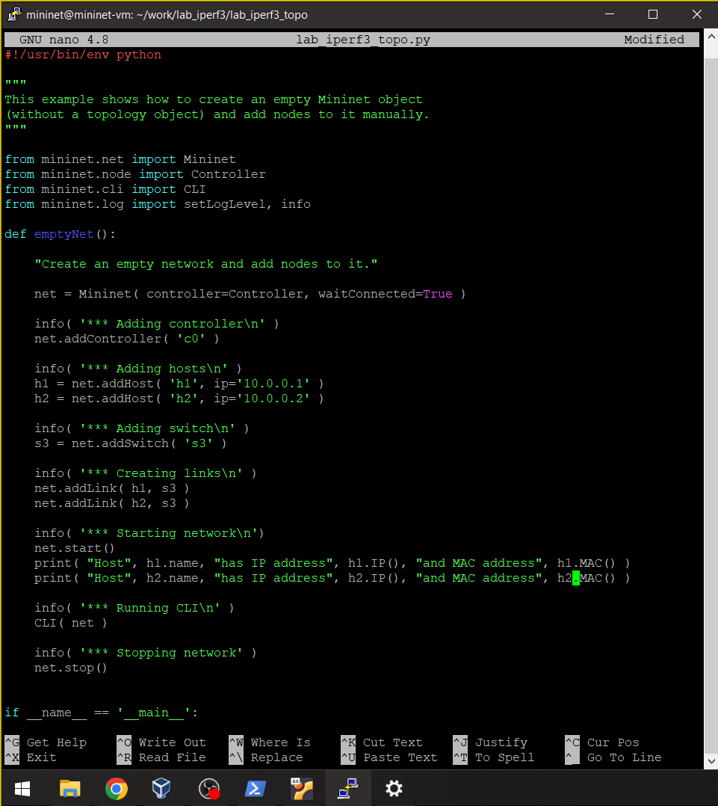
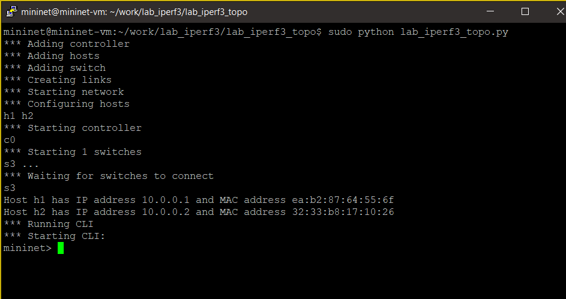
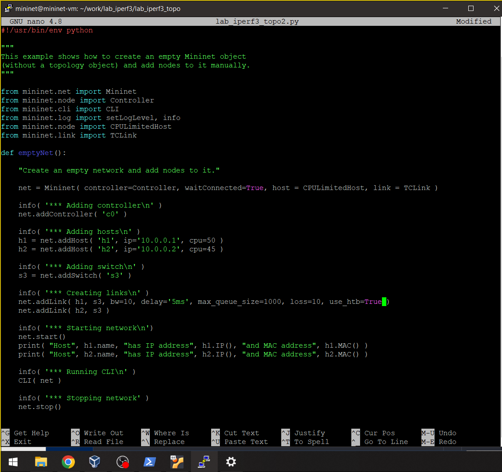
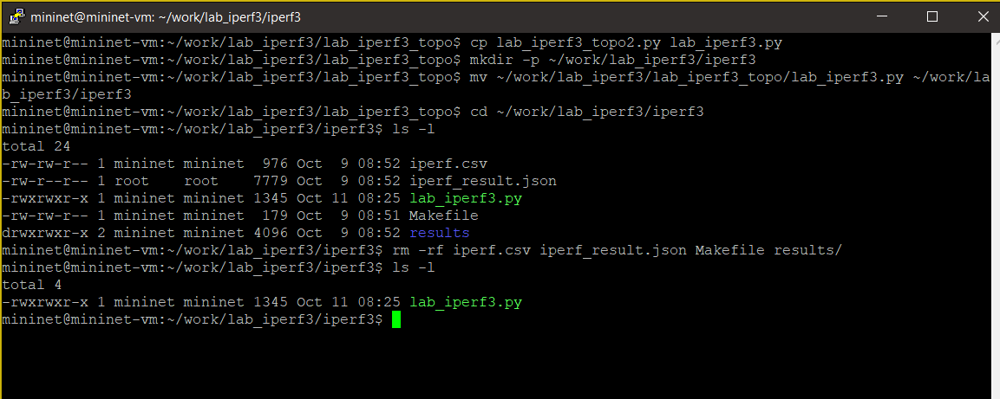
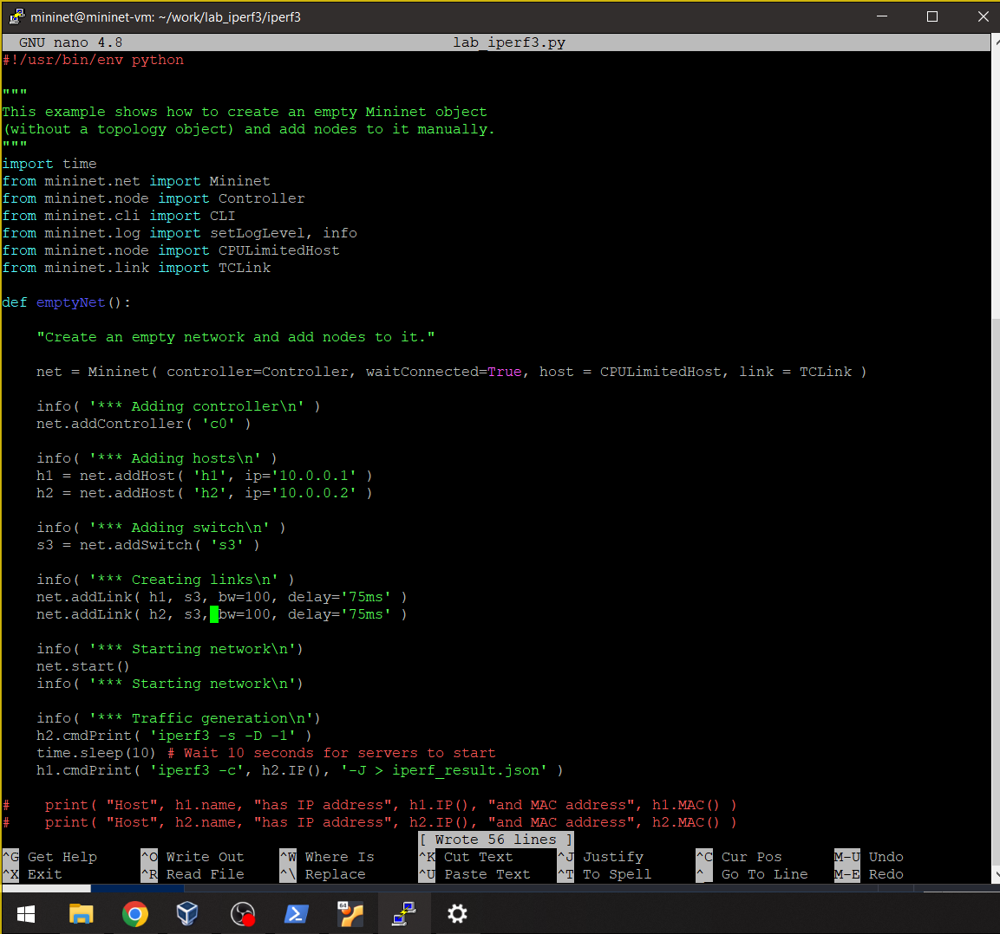
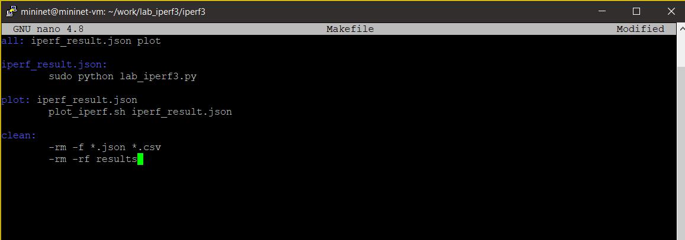
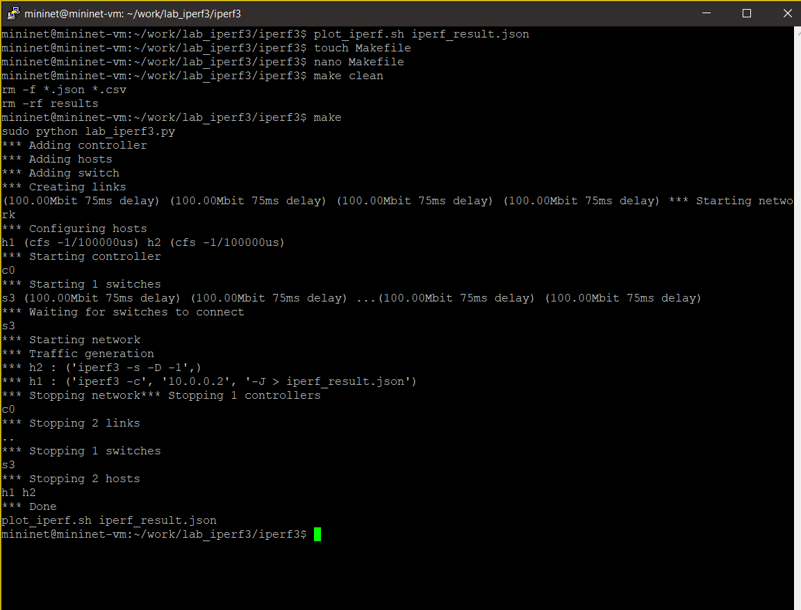

---
## Front matter
title: "Лабораторная работа № 3"
subtitle: "Измерение и тестирование пропускной способности сети. Воспроизводимый эксперимент"
author: "Хрусталев Влад Николаевич"

## Generic otions
lang: ru-RU
toc-title: "Содержание"

## Bibliography
bibliography: bib/cite.bib
csl: pandoc/csl/gost-r-7-0-5-2008-numeric.csl

## Pdf output format
toc: true # Table of contents
toc-depth: 2
lof: true # List of figures
lot: false # List of tables
fontsize: 12pt
linestretch: 1.5
papersize: a4
documentclass: scrreprt
## I18n polyglossia
polyglossia-lang:
  name: russian
  options:
	- spelling=modern
	- babelshorthands=true
polyglossia-otherlangs:
  name: english
## I18n babel
babel-lang: russian
babel-otherlangs: english
## Fonts
mainfont: PT Serif
romanfont: PT Serif
sansfont: PT Sans
monofont: PT Mono
mainfontoptions: Ligatures=TeX
romanfontoptions: Ligatures=TeX
sansfontoptions: Ligatures=TeX,Scale=MatchLowercase
monofontoptions: Scale=MatchLowercase,Scale=0.9
## Biblatex
biblatex: true
biblio-style: "gost-numeric"
biblatexoptions:
  - parentracker=true
  - backend=biber
  - hyperref=auto
  - language=auto
  - autolang=other*
  - citestyle=gost-numeric
## Pandoc-crossref LaTeX customization
figureTitle: "Рис."
tableTitle: "Таблица"
listingTitle: "Листинг"
lofTitle: "Список иллюстраций"
lotTitle: "Список таблиц"
lolTitle: "Листинги"
## Misc options
indent: true
header-includes:
  - \usepackage{indentfirst}
  - \usepackage{float} # keep figures where there are in the text
  - \floatplacement{figure}{H} # keep figures where there are in the text
---

# Цель работы

Основной целью работы является знакомство с инструментом для измерения
пропускной способности сети в режиме реального времени — iPerf3, а также
получение навыков проведения воспроизводимого эксперимента по измерению
пропускной способности моделируемой сети в среде Mininet.

# Теоретическое введение

Mininet[@mininet] -- это эмулятор компьютерной сети. Под компьютерной сетью подразумеваются простые компьютеры — хосты, коммутаторы, а так же OpenFlow-контроллеры. С помощью простейшего синтаксиса в примитивном интерпретаторе команд можно разворачивать сети из произвольного количества хостов, коммутаторов в различных топологиях и все это в рамках одной виртуальной машины(ВМ). На всех хостах можно изменять сетевую конфигурацию, пользоваться стандартными утилитами(ifconfig, ping) и даже получать доступ к терминалу. На коммутаторы можно добавлять различные правила и маршрутизировать трафик.

iPerf3[@iperf] представляет собой кроссплатформенное клиент-серверное приложение с открытым исходным кодом,
которое можно использовать для измерения пропускной способности между
двумя конечными устройствами.
iPerf3 может работать с транспортными протоколами TCP, UDP и SCTP:

- TCP и SCTP:
  - измеряет пропускную способность;
  - позволяет задать размер MSS/MTU;
  - отслеживает размер окна перегрузки TCP (CWnd).
  
- UDP:
  - измеряет пропускную способность;
  - измеряет потери пакетов;
  - измеряет колебания задержки (jitter);
  - поддерживает групповую рассылку пакетов (multicast).

# Задание

1. Воспроизвести посредством API Mininet эксперименты по измерению пропускной способности с помощью iPerf3.
2. Построить графики по проведённому эксперименту.

# Выполнение лабораторной работы

С помощью API Mininet создадим простейшую топологию сети, состоящую из двух хостов и коммутатора 
с назначенной по умолчанию mininet сетью 10.0.0.0/8. Для этого в каталоге /work/lab_iperf3 для 
работы над проектом создадим подкаталог lab_iperf3_topo и скопируем в него файл с примером скрипта
mininet/examples/emptynet.py, описывающего стандартную простую топологию сети mininet (рис. [-@fig:001]):

{ #fig:001 width=100% height=100% }

Изучим содержание скрипта lab_iperf3_topo.py (рис. [-@fig:002]).

В нем написан скрипт по созданию простейшей топологии из двух хостов h1 и h2, а также коммутатора s3 и контроллера c0. В начале файла видим импорт необходимых библиотек.

Основные элементы:

- addSwitch(): добавляет коммутатор в топологию и возвращает имя коммутатора;
- ddHost(): добавляет хост в топологию и возвращает имя хоста;
- addLink(): добавляет двунаправленную ссылку в топологию (и возвращает ключ ссылки; ссылки в Mininet являются двунаправленными, если не указано иное);
- Mininet: основной класс для создания и управления сетью;
- start(): запускает сеть;
- pingAll(): проверяет подключение, пытаясь заставить все узлы пинговать друг друга;
- stop(): останавливает сеть;
- net.hosts: все хосты в сети;
- dumpNodeConnections(): сбрасывает подключения к/от набора узлов;
- setLogLevel( 'info' | 'debug' | 'output' ): устанавливает уровень вывода Mininet по умолчанию; рекомендуется info.

{#fig:002 width=100% height=100% }

Запустим скрипт создания топологии lab_iperf3_topo.py. После отработки скрипта просмотрим 
элементы топологии и завершим работу mininet (рис. [-@fig:003]):

{ #fig:003 width=100% height=100% }

Объеденим два пункта лабораторной работы и внесём измекнения сразу для обоих хостов. А именно внесем в скрипт lab_iperf3_topo.py изменение, позволяющее вывести
на экран информацию обоих хостов сети, а именно имя хоста, его IP-адрес, MAC-адрес(рис. [-@fig:004]):

Здесь:

- IP() возвращает IP-адрес хоста или определенного интерфейса;
- MAC() возвращает MAC-адрес хоста или определенного интерфейса.

{ #fig:004 width=100% height=100% }

Проверим корректность отработки изменённого скрипта (рис. [-@fig:005]):

{ #fig:005 width=100% height=100% }

Нам вывелась информация об IP и mac адресах хостов. 

Mininet предоставляет функции ограничения производительности и изоляции с помощью классов 
CPULimitedHost и TCLink. Добавим в скрипт настройки параметров производительности. Для начала
сделаем копию скрипта lab_iperf3_topo.py. В начале скрипта lab_iperf3_topo2.py добавим записи об импорте классов CPULimitedHost и TCLink. 
Далее изменим строку описания сети, указав на использование ограничения производительности и изоляции.
Следующим шагом изменим функцию задания параметров виртуального хоста h1, указав, что ему 
будет выделено 50% от общих ресурсов процессора системы. Аналогичным образом для хоста h2 зададим долю выделения ресурсов
процессора в 45%. В конце изменим функцию параметров соединения между хостом h1 и коммутатором s3 (рис. [-@fig:006]).

{#fig:006 width=100% height=100%}

Запустим на отработку сначала скрипт lab_iperf3_topo2.py, затем
lab_iperf3_topo.py и сравним результат (рис. [-@fig:007]). Видим, что в первом случае у нас создалась сеть с настроенными параметрами, а во втором случае дефолтная сеть без этих параметров.

{#fig:007 width=100% height=100%}

Сделаем копию скрипта lab_iperf3_topo2.py и поместим его в подкаталог iperf рис. [-@fig:008]).

{#fig:008 width=100% height=100%}

В начале скрипта lab_iperf3.py добавим запись об импорте time и изменим код в скрипте так, чтобы (рис. [-@fig:009]):
- на хостах не было ограничения по использованию ресурсов процессора;
- каналы между хостами и коммутатором были по 100 Мбит/с с задержкой 75 мс, без потерь, без использования ограничителей пропускной
способности и максимального размера очереди

{#fig:009 width=100% height=100%}

Запустим на отработку скрипт lab_iperf3.py (рис. [-@fig:010]).

{#fig:010 width=100% height=100%}

Построим графики из получившегося JSON-файла (рис. [-@fig:012]). Создадим Makefile для проведения всего эксперимента. В Makefile пропишем запуск скрипта эксперимента, построение графиков и очистку каталога от результатов (рис. [-@fig:011]).

{#fig:011 width=100% height=100%}

Проверьте корректность отработки Makefile (рис. [-@fig:012]).

{#fig:012 width=100% height=100%}

# Выводы

В ходе выполнения лабораторной работы я познакомился с инструментом для измерения
пропускной способности сети в режиме реального времени — iPerf3, а также
получение навыков проведения интерактивного эксперимента по измерению
пропускной способности моделируемой сети в среде Mininet.

# Список литературы{.unnumbered}

::: {#refs}
:::