---
## Front matter
lang: ru-RU
title: "Лабораторная работа №4"
subtitle: "Эмуляция и измерение задержек в глобальных сетях"
author:
  - Хрусталев В.Н.
institute:
  - Российский университет дружбы народов, Москва, Россия

## i18n babel
babel-lang: russian
babel-otherlangs: english

## Formatting pdf
toc: false
toc-title: Содержание
slide_level: 2
aspectratio: 169
section-titles: true
theme: metropolis
header-includes:
 - \metroset{progressbar=frametitle,sectionpage=progressbar,numbering=fraction}
---

# Информация

## Докладчик

:::::::::::::: {.columns align=center}
::: {.column width="70%"}

  * Хрусталев Влад Николаевич
  * студент
  * Российский университет дружбы народов
  * [1132222011@pfur.ru](mailto:1132222011@pfur.ru)

:::
::: {.column width="25%"}

:::
::::::::::::::

# Цель работы

Основной целью работы является знакомство с NETEM — инструментом для тестирования производительности приложений в виртуальной сети, а также получение навыков проведения интерактивного и воспроизводимого экспериментов по измерению задержки и её дрожания (jitter) в моделируемой сети в среде Mininet.

# Выполнение лабораторной работы

## Исправление прав запуска X-соединения

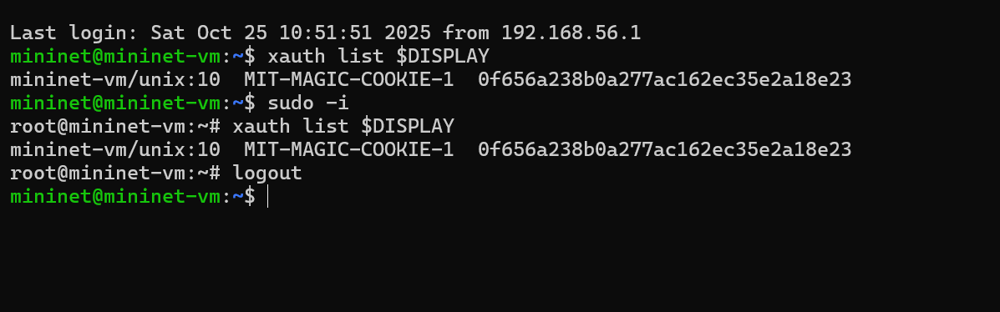{#fig:001 width=70%}

## Простейшая топология

{#fig:002 width=70%}

## ifconfig на хостах h1 и h2

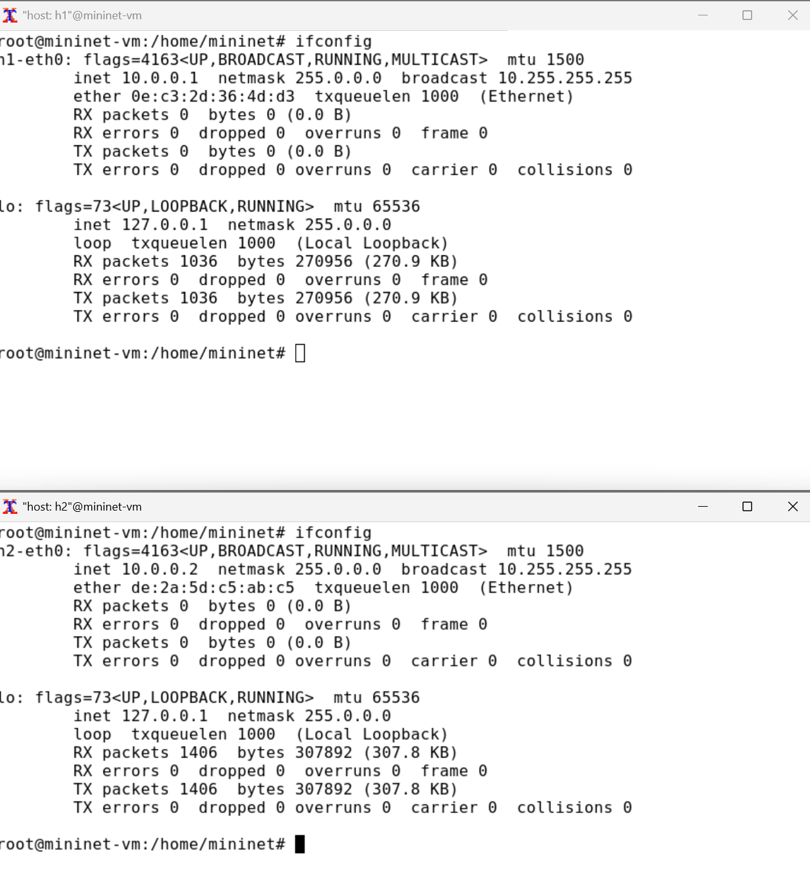{#fig:003 width=70%}

## Проверка подключения между хостами

{#fig:004 width=70%}

## Добавление задержки в 100мс

{#fig:005 width=70%}

## Двунаправленная задержка соединения

{#fig:006 width=70%}

## Изменение задержки на 50мс

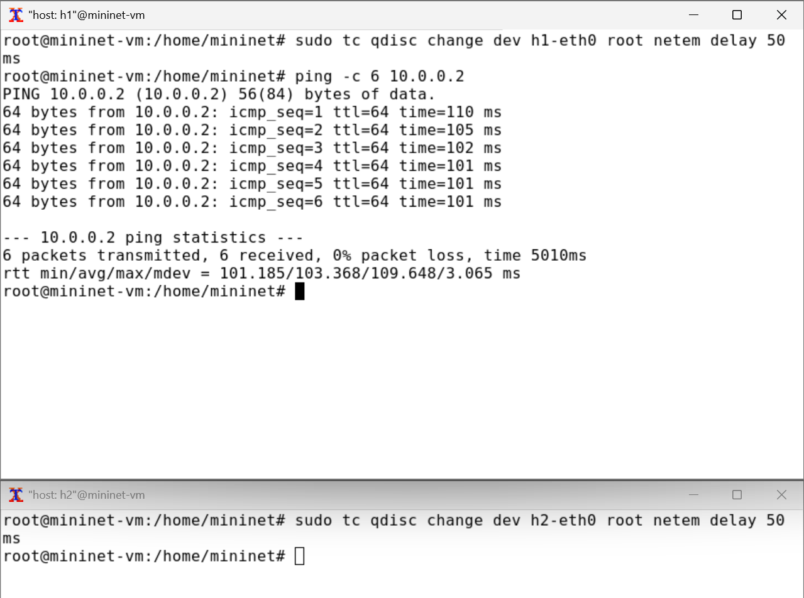{#fig:007 width=70%}

## Восстановление исходных значений задержки

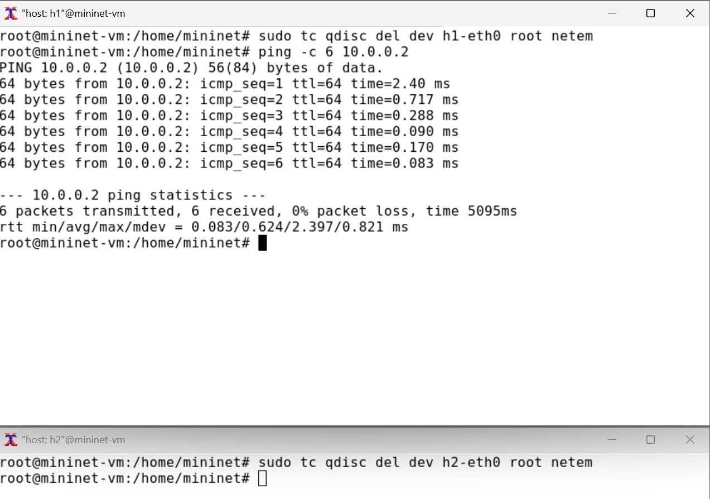{#fig:008 width=70%}

## Добавление значения дрожания задержки в интерфейс подключения

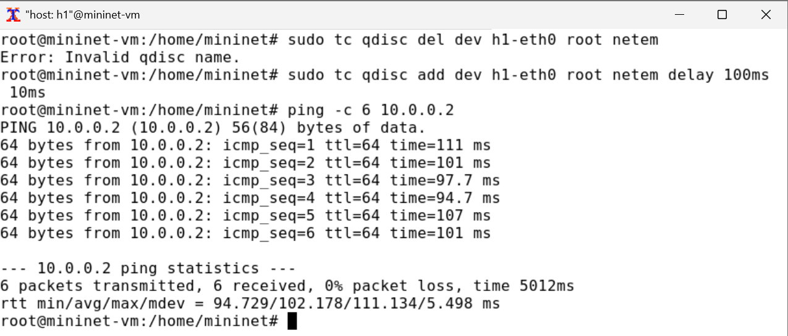{#fig:009 width=70%}

## Добавление значения корреляции для джиттера и задержки в интерфейс подключения

{#fig:010 width=70%}

## Распределение задержки в интерфейсе подключения

{#fig:011 width=70%}

## Подготовка к производимому эксперименту

{#fig:012 width=70%}

## Листинг lab_netem_i.py

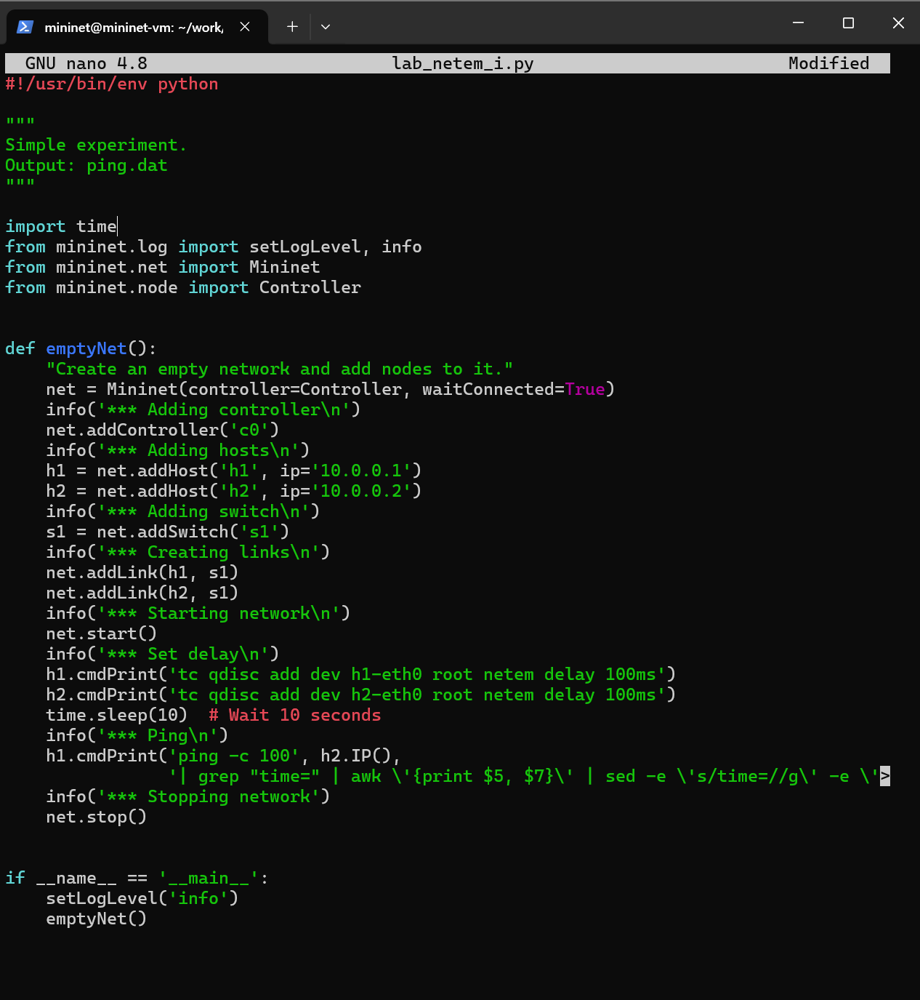{#fig:013 width=70%}

## Листинг ping_plot

{#fig:014 width=70%}

## Выдача прав выполнения для ping_plot

{#fig:015 width=70%}

## Листинг Makefile

{#fig:016 width=70%}

## Запуск эксперимента

{#fig:017 width=70%}

## Просмотр графика

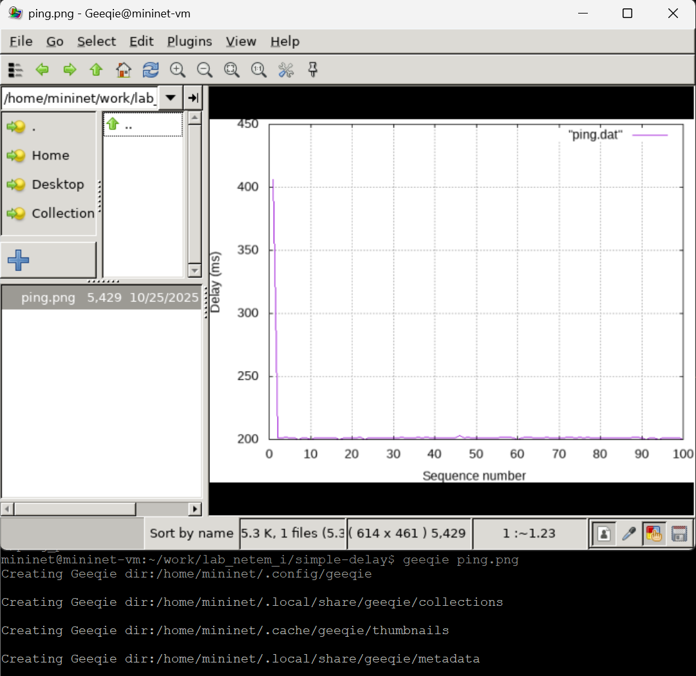{#fig:018 width=70%}

## Удаление первой строчки из файла ping.dat

{#fig:019 width=70%}

## Просмотр графика после удаления первой строки

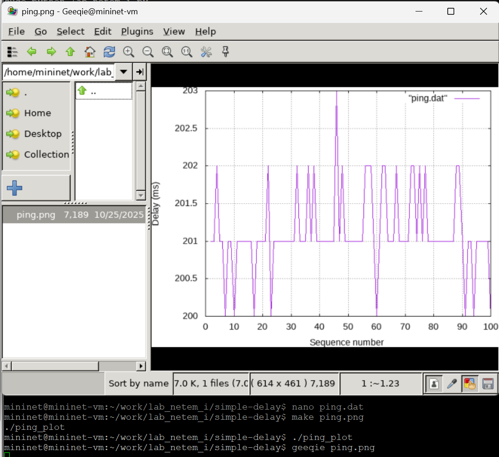{#fig:020 width=70%}

## Разработка скрипта для вычисления статистических данных

{#fig:021 width=70%}

## Тестирование разработанного скрипта

{#fig:022 width=70%}

## Добавление правила запуска скрипта в Makefile

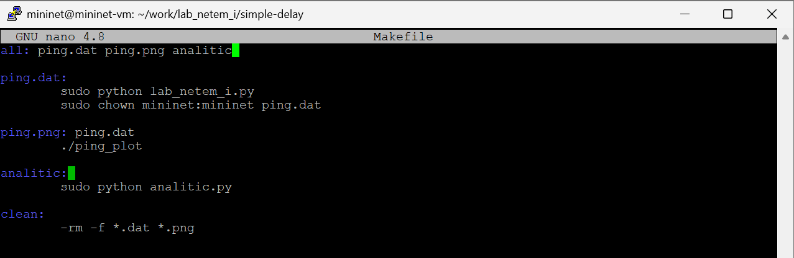{#fig:023 width=70%}

## Очистка результатов эксперимента

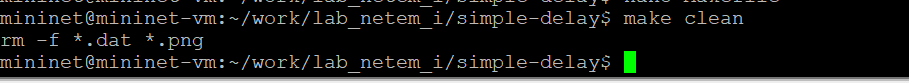{#fig:024 width=70%}

## Листинг - Воспроизводимый эксперимент по изменению задержки

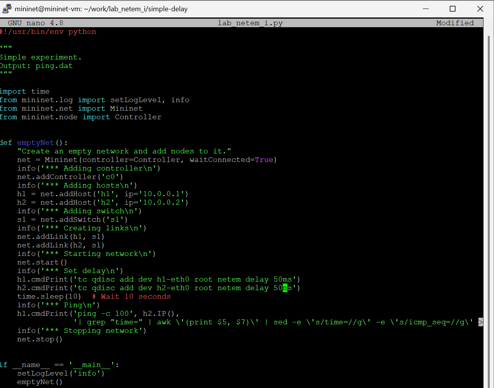{#fig:025 width=70%}

## Вывод - Воспроизводимый эксперимент по изменению задержки

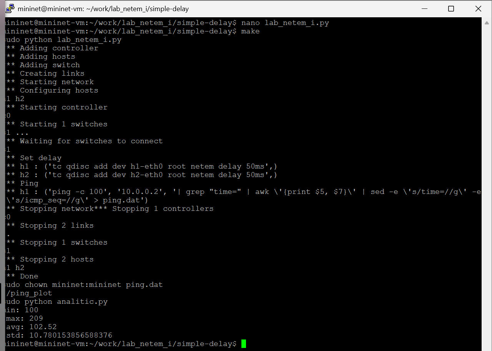{#fig:026 width=70%}

## График - Воспроизводимый эксперимент по изменению задержки

{#fig:027 width=70%}

## Листинг - Воспроизводимый эксперимент по изменению джиттера

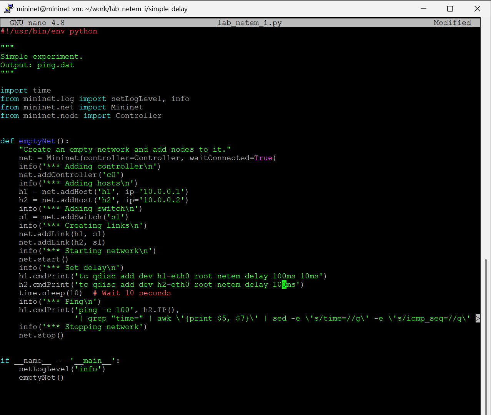{#fig:028 width=70%}

## Вывод - Воспроизводимый эксперимент по изменению джиттера

{#fig:029 width=70%}

## График - Воспроизводимый эксперимент по изменению джиттера

{#fig:030 width=70%}

## Листинг - Воспроизводимый эксперимент по изменению значения корреляции для джиттера и задержки

{#fig:031 width=70%}

## Вывод - Воспроизводимый эксперимент по изменению значения корреляции для джиттера и задержки

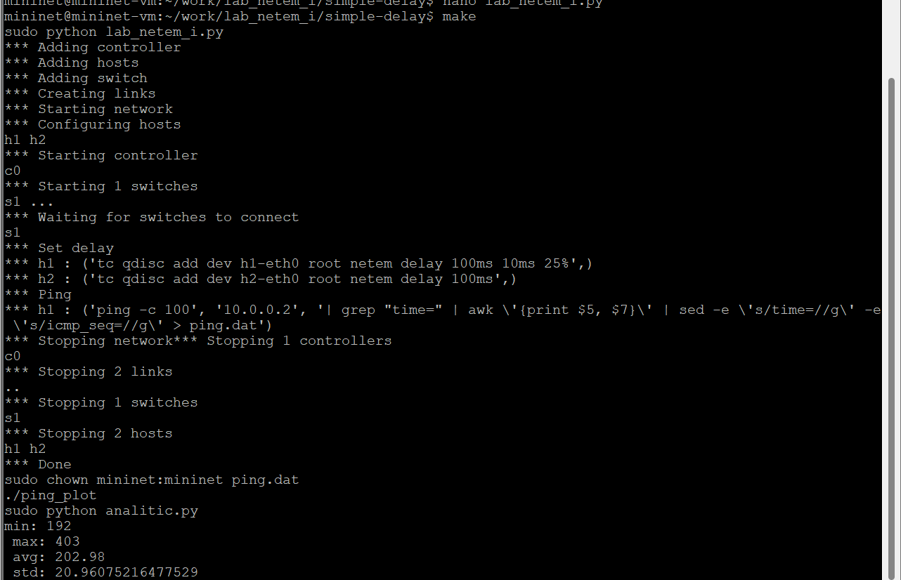{#fig:032 width=70%}

## График - Воспроизводимый эксперимент по изменению значения корреляции для джиттера и задержки

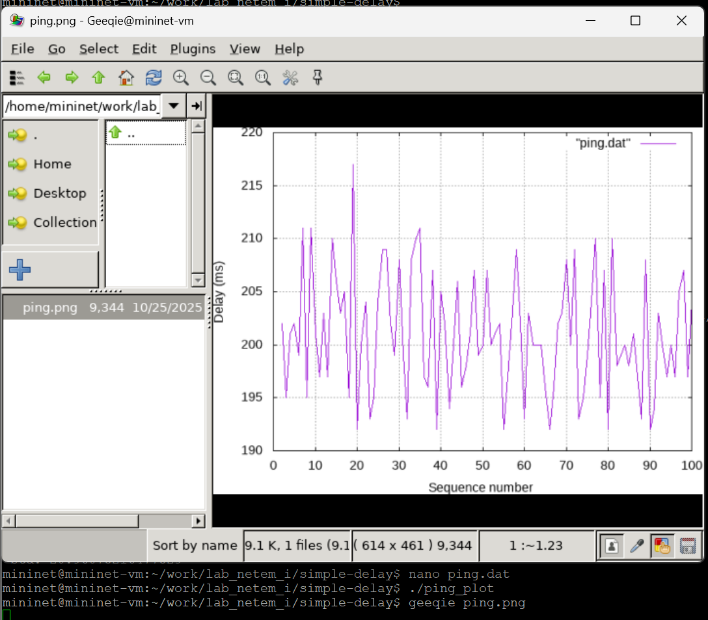{#fig:033 width=70%}

## Листинг - Воспроизводимый эксперимент по изменению распределения времени задержки

{#fig:034 width=70%}

## Вывод - Воспроизводимый эксперимент по изменению распределения времени задержки

{#fig:035 width=70%}

## График - Воспроизводимый эксперимент по изменению распределения времени задержки

{#fig:036 width=70%}

## Создание папок под эксперименты

{#fig:037 width=70%}

# Выводы

В результате выполнения данной лабораторной работы я познакомилcя с NETEM -- инструментом для тестирования производительности приложений в виртуальной сети, а также получил навыки проведения интерактивного и воспроизводимого экспериментов по измерению задержки и её дрожания (jitter) в моделируемой сети в среде Mininet.

# Список литературы

1. Mininet [Электронный ресурс]. Mininet Project Contributors. URL: http://mini
net.org/ (дата обращения: 06.10.2025).

# {.standout}
