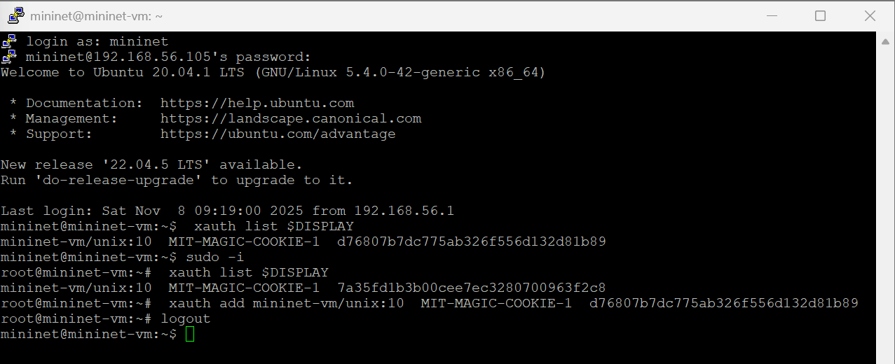
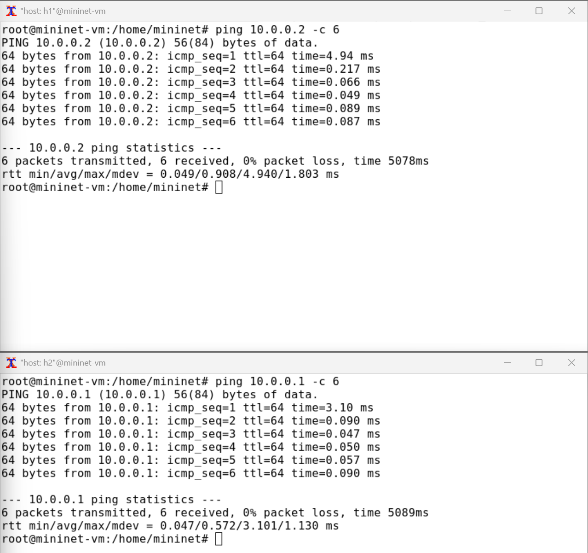
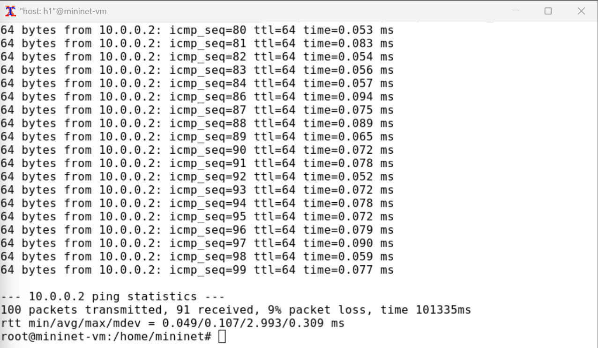
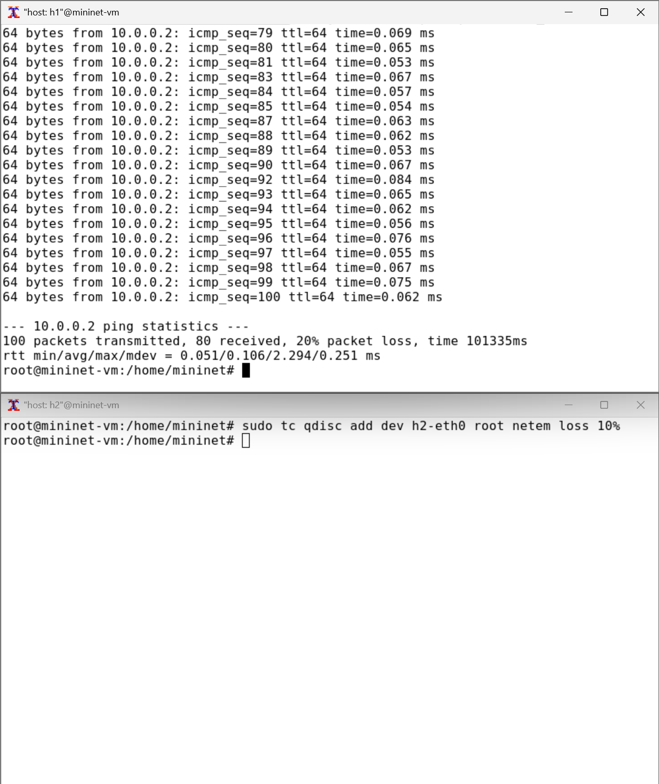
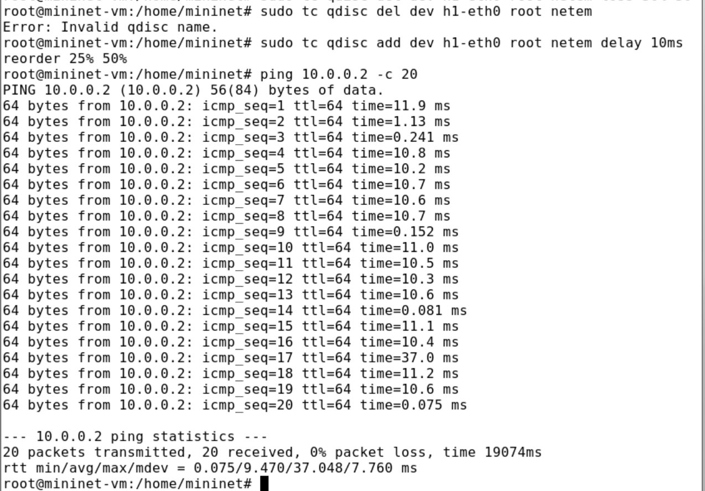
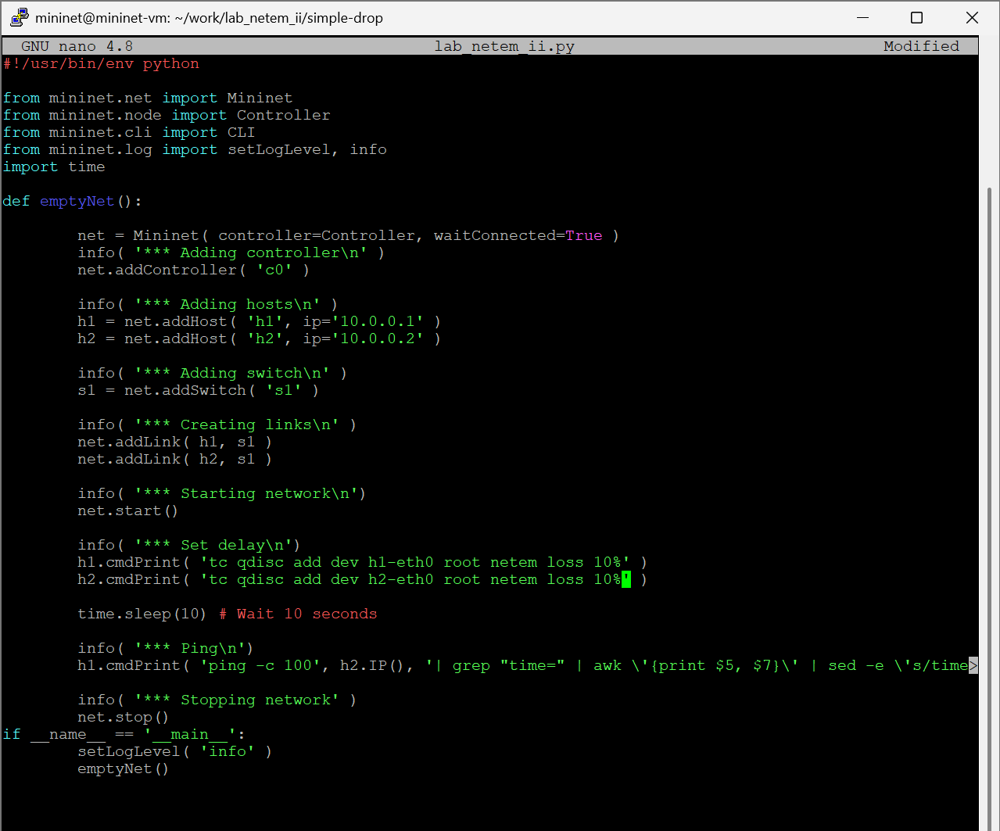
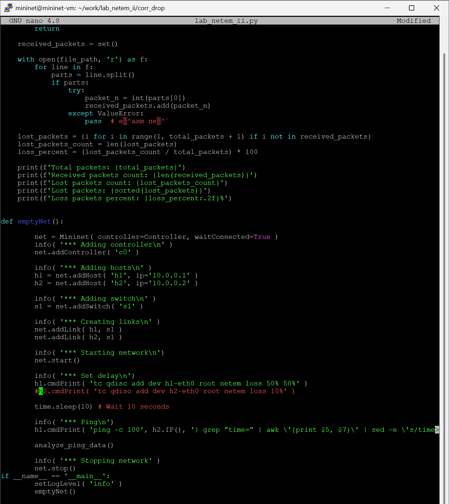
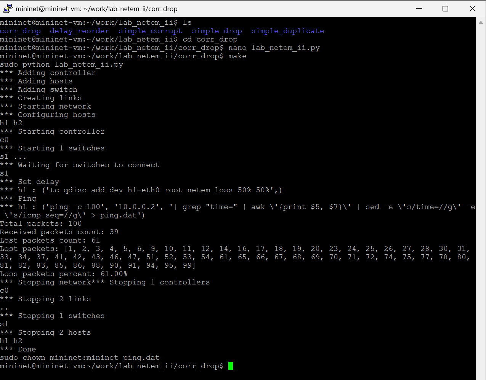
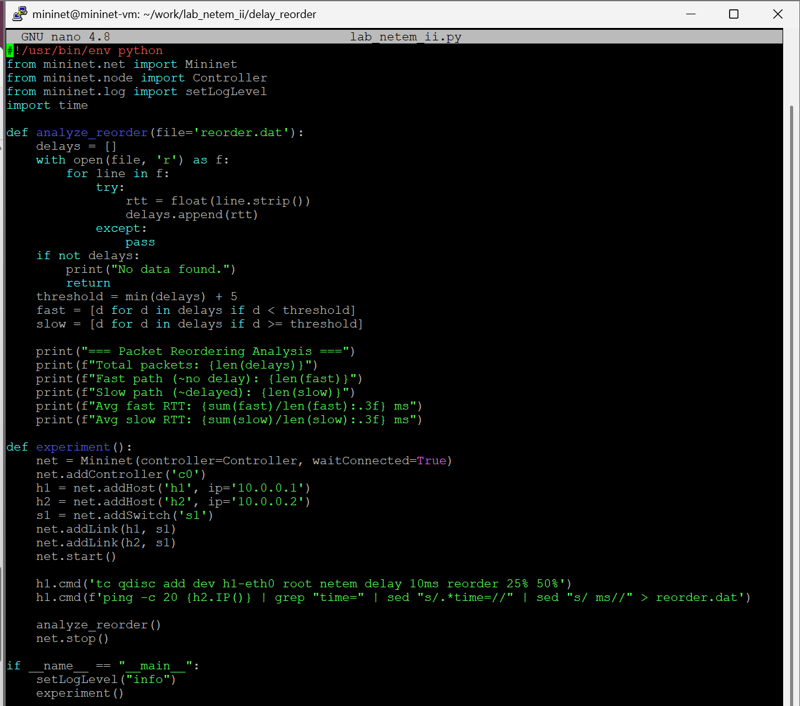
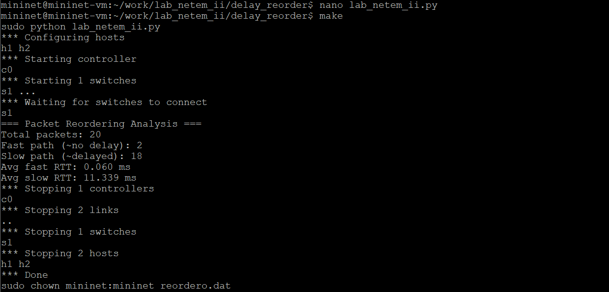

---
## Front matter
lang: ru-RU
title: "Лабораторная работа №5"
subtitle: "Эмуляция и измерение потерь пакетов в глобальных сетях"
author:
  - Хрусталев В.Н.
institute:
  - Российский университет дружбы народов, Москва, Россия

## i18n babel
babel-lang: russian
babel-otherlangs: english

## Formatting pdf
toc: false
toc-title: Содержание
slide_level: 2
aspectratio: 169
section-titles: true
theme: metropolis
header-includes:
 - \metroset{progressbar=frametitle,sectionpage=progressbar,numbering=fraction}
---

# Информация

## Докладчик

:::::::::::::: {.columns align=center}
::: {.column width="70%"}

  * Хрусталев Влад Николаевич
  * студент
  * Российский университет дружбы народов
  * [1132222011@pfur.ru](mailto:1132222011@pfur.ru)

:::
::: {.column width="25%"}

:::
::::::::::::::

# Цель работы

Основной целью работы является получение навыков проведения интерактивных экспериментов в среде Mininet по исследованию параметров сети, связанных с потерей, дублированием, изменением порядка и повреждением пакетов при передаче данных. Эти параметры влияют на производительность протоколов и сетей.

# Выполнение лабораторной работы

## Исправление прав запуска X-соединения в виртуальной машине mininet

{#fig:001 width=70%}

## Информация о сетевых интерфейсах и IP-адресах хостов

{#fig:002 width=70%}

## Проверка подключения между хостами h1 и h2

{#fig:003 width=70%}

## Добавление 10% потерь пакетов на хосте h1

{#fig:004 width=70%}

## Проверка потерь пакетов 1

{#fig:005 width=70%}

## Проверка потерь пакетов 2

{#fig:006 width=70%}

## Восстановление конфигурации по умолчанию для хоста h1 и хоста h2 и проверка

{#fig:007 width=70%}

## Добавление значения корреляции для потери пакетов и тест

{#fig:008 width=70%}

## Добавление на узле h1 0.01% повреждения пакетов и проверка через iperf

{#fig:009 width=70%}

## Добавление переупорядочивания пакетов и тест

{#fig:010 width=70%}

## Добавление дублирования пакетов и тест

{#fig:011 width=70%}

## Листинг lab_netem_ii для simple-drop из лабораторной

{#fig:012 width=70%}

## Листинг lab_netem_ii для simple-drop с анализом

{#fig:013 width=70%}

## Листинг Makefile для simple-drop

{#fig:014 width=70%}

## Выполнение эксперимента и последующая очистка каталога

{#fig:015 width=70%}

## Создание каталогов для самостоятельной работы

{#fig:016 width=70%}

## Листинг программы для эксперимента по добавлению потери и коэффициента корреляции

{#fig:017 width=70%}

## Выполнение эксперимента по добавлению потери и коэффициента корреляции

{#fig:018 width=70%}

## Листинг программы для эксперимента по повреждению пакетов

{#fig:019 width=70%}

## Выполнение эксперимента по повреждению пакетов

{#fig:020 width=70%}

## Листинг программы для эксперимента по изменению порядка пакетов

{#fig:021 width=70%}

## Выполнение эксперимента по изменению порядка пакетов

{#fig:022 width=70%}

## Листинг программы для эксперимента по дублированию пакетов

{#fig:023 width=70%}

## Выполнение эксперимента по дублированию пакетов

{#fig:024 width=70%}

# Выводы

В результате выполнения данной лабораторной работы я получил навыки проведения интерактивных экспериментов в среде Mininet по исследованию параметров сети, связанных с потерей, дублированием, изменением порядка и повреждением пакетов при передаче данных.

# Список литературы

1. Mininet [Электронный ресурс]. Mininet Project Contributors. URL: http://mini
net.org/ (дата обращения: 06.10.2025).

# {.standout}
