---
## Front matter
title: "Лабораторная работа №5"
subtitle: "Эмуляция и измерение потерь пакетов в глобальных сетях"
author: "Хрусталев Влад Николаевич"

## Generic otions
lang: ru-RU
toc-title: "Содержание"

## Bibliography
bibliography: bib/cite.bib
csl: pandoc/csl/gost-r-7-0-5-2008-numeric.csl

## Pdf output format
toc: true # Table of contents
toc-depth: 2
lof: true # List of figures
lot: false # List of tables
fontsize: 12pt
linestretch: 1.5
papersize: a4
documentclass: scrreprt
## I18n polyglossia
polyglossia-lang:
  name: russian
  options:
	- spelling=modern
	- babelshorthands=true
polyglossia-otherlangs:
  name: english
## I18n babel
babel-lang: russian
babel-otherlangs: english
## Fonts
mainfont: PT Serif
romanfont: PT Serif
sansfont: PT Sans
monofont: PT Mono
mainfontoptions: Ligatures=TeX
romanfontoptions: Ligatures=TeX
sansfontoptions: Ligatures=TeX,Scale=MatchLowercase
monofontoptions: Scale=MatchLowercase,Scale=0.9
## Biblatex
biblatex: true
biblio-style: "gost-numeric"
biblatexoptions:
  - parentracker=true
  - backend=biber
  - hyperref=auto
  - language=auto
  - autolang=other*
  - citestyle=gost-numeric
## Pandoc-crossref LaTeX customization
figureTitle: "Рис."
tableTitle: "Таблица"
listingTitle: "Листинг"
lofTitle: "Список иллюстраций"
lotTitle: "Список таблиц"
lolTitle: "Листинги"
## Misc options
indent: true
header-includes:
  - \usepackage{indentfirst}
  - \usepackage{float} # keep figures where there are in the text
  - \floatplacement{figure}{H} # keep figures where there are in the text
---

# Цель работы

Основной целью работы является получение навыков проведения интерактивных экспериментов в среде Mininet по исследованию параметров сети, связанных с потерей, дублированием, изменением порядка и повреждением пакетов при передаче данных. Эти параметры влияют на производительность протоколов и сетей.

# Теоретическое введение

Mininet[@mininet] -- это эмулятор компьютерной сети. Под компьютерной сетью подразумеваются простые компьютеры — хосты, коммутаторы, а так же OpenFlow-контроллеры. С помощью простейшего синтаксиса в примитивном интерпретаторе команд можно разворачивать сети из произвольного количества хостов, коммутаторов в различных топологиях и все это в рамках одной виртуальной машины(ВМ). На всех хостах можно изменять сетевую конфигурацию, пользоваться стандартными утилитами(ifconfig, ping) и даже получать доступ к терминалу. На коммутаторы можно добавлять различные правила и маршрутизировать трафик.

# Задание 

1. Задайте простейшую топологию, состоящую из двух хостов и коммутатора с назначенной по умолчанию mininet сетью 10.0.0.0/8.

2. Проведите интерактивные эксперименты по по исследованию параметров сети, связанных с потерей, дублированием, изменением порядка и повреждением пакетов при передаче данных.

3. Реализуйте воспроизводимый эксперимент по добавлению правила отбрасывания пакетов в эмулируемой глобальной сети. На экран выведите сводную информацию о потерянных пакетах.

4. Самостоятельно реализуйте воспроизводимые эксперименты по исследованию параметров сети, связанных с потерей, изменением порядка и повреждением пакетов при передаче данных. На экран выведите сводную
информацию о потерянных пакетах.

# Выполнение лабораторной работы

В виртуальной машине mininet исправим права запуска X-соединения  (рис. [-@fig:001]).

{#fig:001 width=70%}

Зададим простейшую топологию, состоящую из двух хостов и коммутатора с назначенной по умолчанию mininet сетью 10.0.0.0/8. На хостах h1 и h2 введем команду ifconfig, чтобы отобразить информацию, относящуюся к их сетевым интерфейсам и назначенным им IP-адресам. В дальнейшем при работе с NETEM и командой tc будут использоваться интерфейсы h1-eth0 и h2-eth0 (рис. [-@fig:002]).

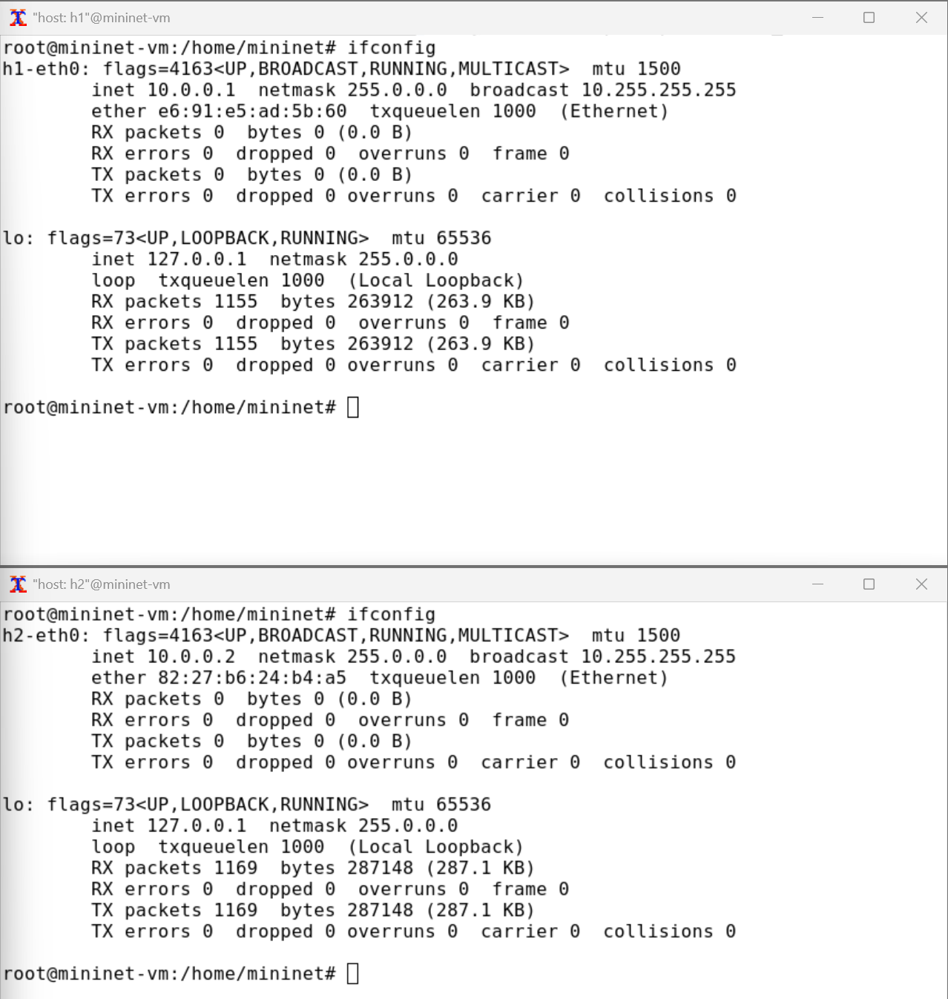{#fig:002 width=70%}

Проверим подключение между хостами h1 и h2 с помощью команды ping с параметром -c 6 (рис. [-@fig:003]).

{#fig:003 width=70%}

Пакеты могут быть потеряны в процессе передачи из-за таких факторов, как
битовые ошибки и перегрузка сети. Скорость потери данных часто измеряется
как процентная доля потерянных пакетов по отношению к количеству отправленных пакетов.
На хосте h1 добавим 10% потерь пакетов к интерфейсу h1-eth0 (рис. [-@fig:004]):

`sudo tc qdisc add dev h1-eth0 root netem loss 10%` 

Здесь:

- sudo: выполнить команду с более высокими привилегиями;
- tc: вызвать управление трафиком Linux;
- qdisc: изменить дисциплину очередей сетевого планировщика;
- add: создать новое правило;
- dev h1-eth0: указать интерфейс, на котором будет применяться правило;
- netem: использовать эмулятор сети;
- loss 10%: 10% потерь пакетов.

{#fig:004 width=70%}

Проверим, что на соединении от хоста h1 к хосту h2 имеются потери пакетов, используя команду ping с параметром -c 100 с хоста h1.(рис. [-@fig:005]).

{#fig:005 width=70%}

Для эмуляции глобальной сети с потерей пакетов в обоих направлениях
необходимо к соответствующему интерфейсу на хосте h2 также добавить 10%
потерь пакетов.
Проверим, что соединение между хостом h1 и хостом h2 имеет больший процент потерянных данных (10% от хоста h1 к хосту h2 и 10% от хоста h2 к хосту
h1), повторив команду ping с параметром -c 100 на терминале хоста h1(рис. [-@fig:006]).

{#fig:006 width=70%}

Пропущенны номера icmp_seq (возможны значения от 1 до 100): [2, 9, 14, 19, 22, 25, 31, 33, 42, 44, 49, 55, 59, 67, 69, 73, 78, 82, 85, 91].

Восстановим конфигурацию по умолчанию, удалив все правила, применённые к сетевому планировщику 
соответствующего интерфейса. Убедимся, что соединение от хоста h1 к хосту h2 не имеет явной потери пакетов, 
запустив команду ping с терминала хоста h1 и затем нажав Ctrl + c , чтобы остановить тест(рис. [-@fig:007]).

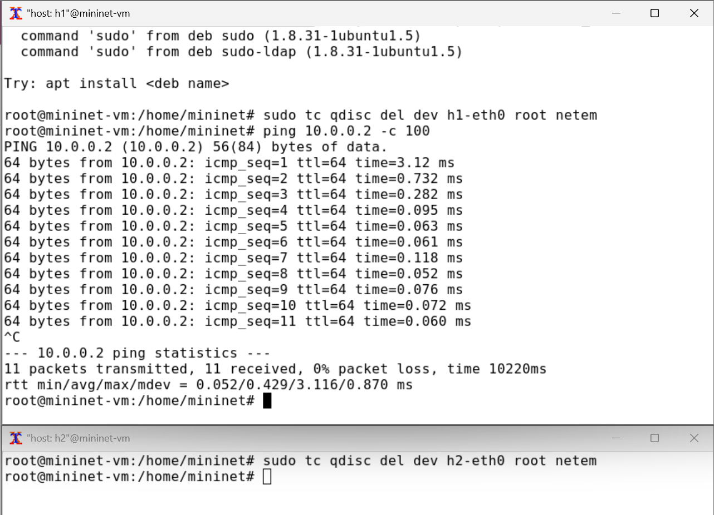{#fig:007 width=70%}

Добавим на интерфейсе узла h1 коэффициент потери пакетов 50% (такой
высокий уровень потери пакетов маловероятен), и каждая последующая
вероятность зависит на 50% от последней:
Проверим, что на соединении от хоста h1 к хосту h2 имеются потери пакетов,
используя команду ping с параметром -c 50 с хоста h1(рис. [-@fig:008]).

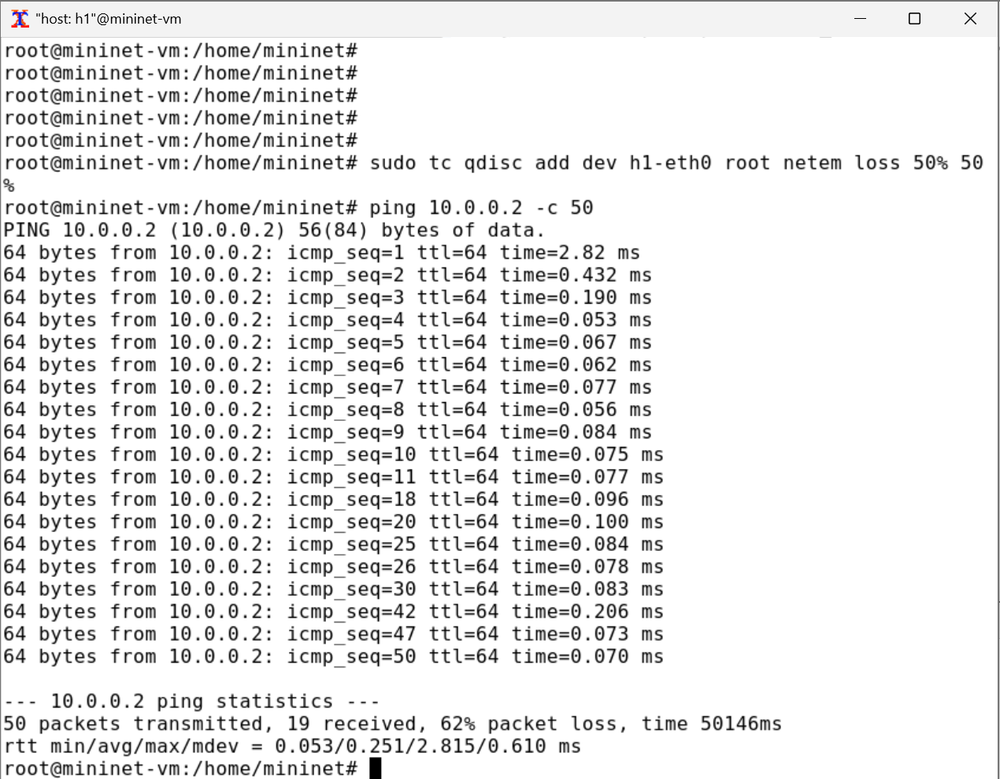{#fig:008 width=70%}

Восстановим конфигурацию интерфейса по умолчанию на узле h1. Добавим на интерфейсе узла h1 0,01% повреждения пакетов.
Проверим конфигурацию с помощью инструмента iPerf3 для проверки
повторных передач (рис. [-@fig:009]).

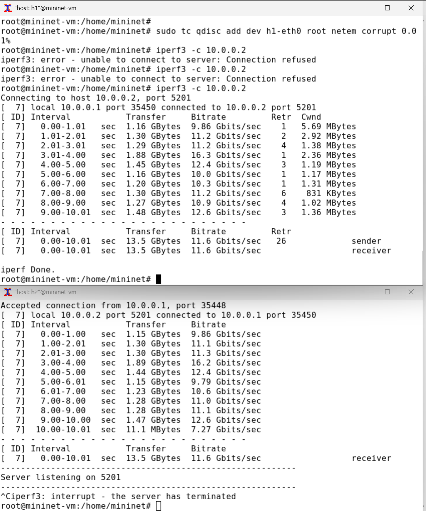{#fig:009 width=70%}

Восстановим конфигурацию интерфейса по умолчанию на узле h1. Добавим на интерфейсе узла h1 следующее правило: 25% пакетов (со значением корреляции 50%) будут отправлены немедленно, а остальные 75% будут задержаны на 10 мс. Проверим, что на соединении от хоста h1 к хосту h2 имеются потери пакетов,
используя команду ping с параметром -c 20 с хоста h1. Убедимся, что часть
пакетов не будут иметь задержки (один из четырех, или 25%), а последующие несколько пакетов будут иметь задержку около 10 миллисекунд (три
из четырех, или 75%)(рис. [-@fig:010]).

{#fig:010 width=70%}

Восстановим конфигурацию интерфейса по умолчанию на узле h1. Для интерфейса узла h1 зададим правило c дублированием 50% пакетов (т.е.
50% пакетов должны быть получены дважды):
Проверим, что на соединении от хоста h1 к хосту h2 имеются дублированные
пакеты, используя команду ping с параметром -c 20 с хоста h1. Дубликаты
пакетов помечаются как DUP!(рис. [-@fig:011]).

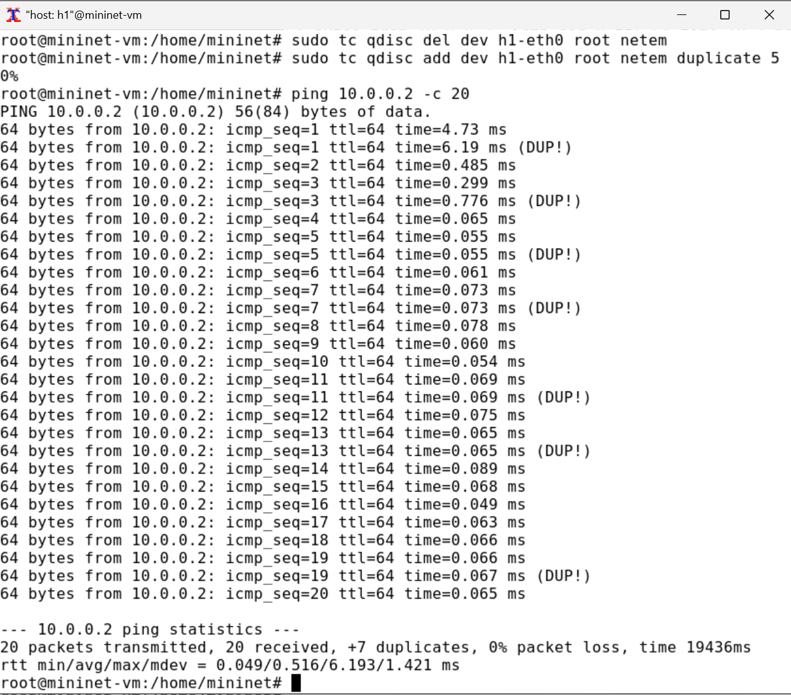{#fig:011 width=70%}

Для каждого воспроизводимого эксперимента expname создадим свой каталог, 
в котором будут размещаться файлы эксперимента. В виртуальной среде mininet в своём рабочем каталоге с проектами создадим каталог simple-drop и перейдём в него. Создадим скрипт для эксперимента lab_netem_ii.py и внесём в него листинг программы(рис. [-@fig:012]).

{#fig:012 width=70%}

Скорректируем скрипт так, чтобы на экран или в отдельный файл выводилась информация о потерях пакетов(рис. [-@fig:013]).

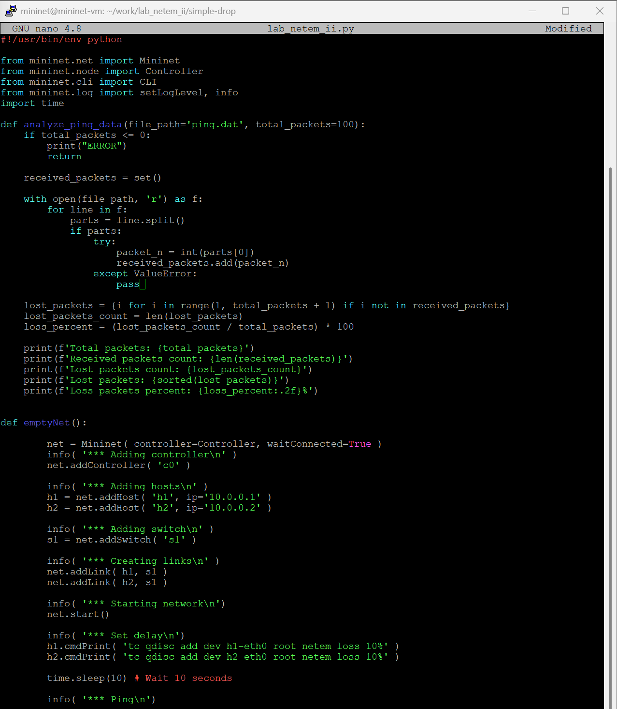{#fig:013 width=70%}

Создадим Makefile для управления процессом проведения эксперимента(рис. [-@fig:014]).

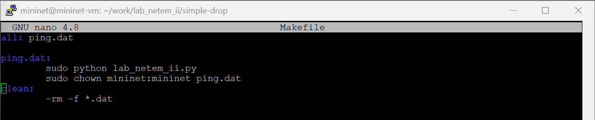{#fig:014 width=70%}

Выполним эксперимент и далее очистим каталог от результатов проведения экспериментов(рис. [-@fig:015]).

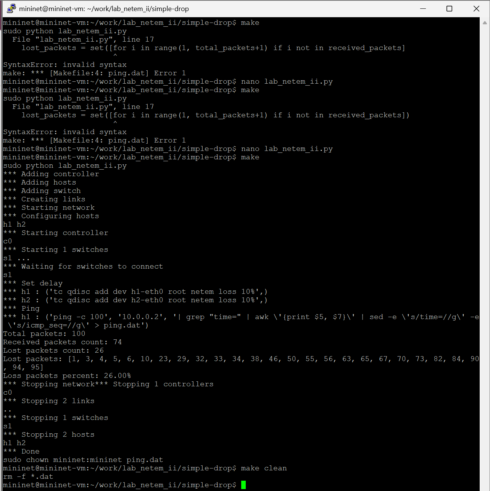{#fig:015 width=70%}

Теперь создадим каталоги основываясь на simple-drop под выполнение самостоятельной работы(рис. [-@fig:016]).

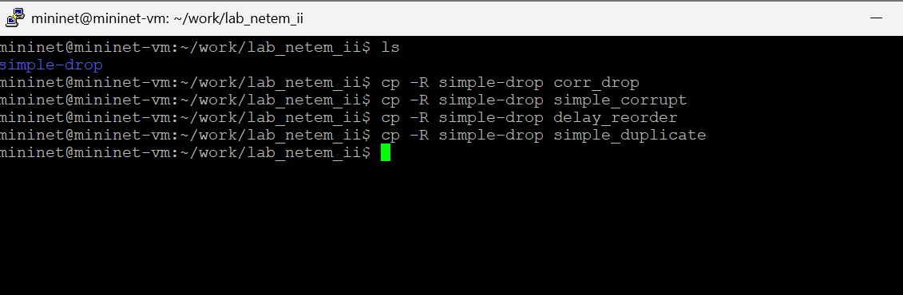{#fig:016 width=70%}

Далее реализуем воспроизводимые эксперименты по исследованию параметров сети, связанных 
с потерей, изменением порядка и повреждением пакетов при передаче данных.

Скорретктируем lab_netem_ii.py для эксепиремента по добавлению потери и коэффицента корреляции.(рис. [-@fig:017])

{#fig:017 width=70%}

Запустим скрипт.(рис. [-@fig:018])

{#fig:018 width=70%}

Скорретктируем lab_netem_ii.py для эксепиремента по повреждению пакетов.(рис. [-@fig:019])

{#fig:019 width=70%}

Запустим скрипт.(рис. [-@fig:020])

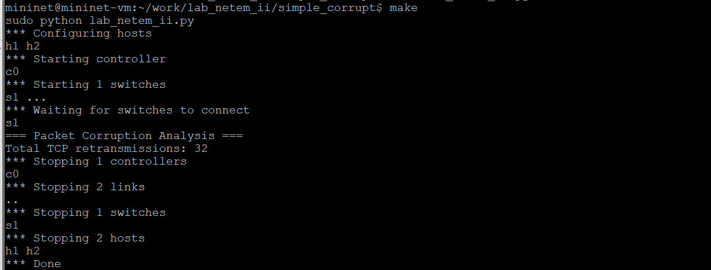{#fig:020 width=70%}

Скорретктируем lab_netem_ii.py для эксепиремента по изменению порядка пакетов.(рис. [-@fig:021])

{#fig:021 width=70%}

Запустим скрипт.(рис. [-@fig:022])

{#fig:022 width=70%}

Скорретктируем lab_netem_ii.py для эксепиремента по дублированию пакетов.(рис. [-@fig:023])

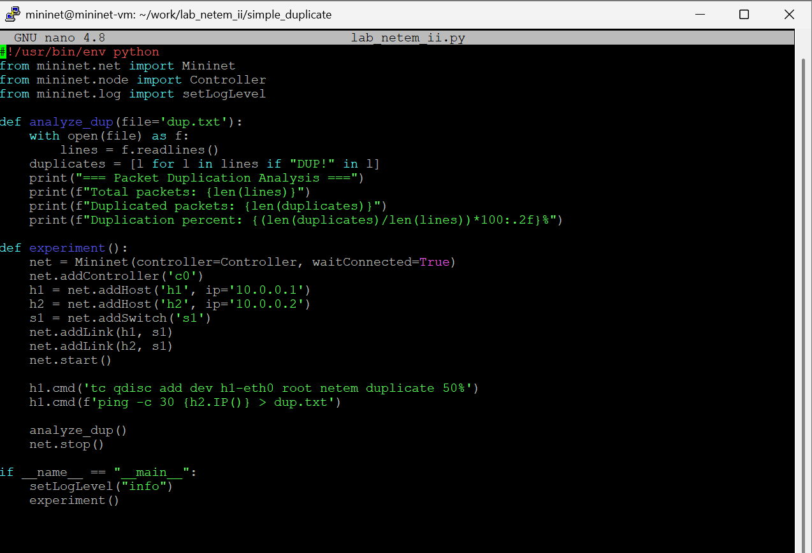{#fig:023 width=70%}

Запустим скрипт.(рис. [-@fig:024])

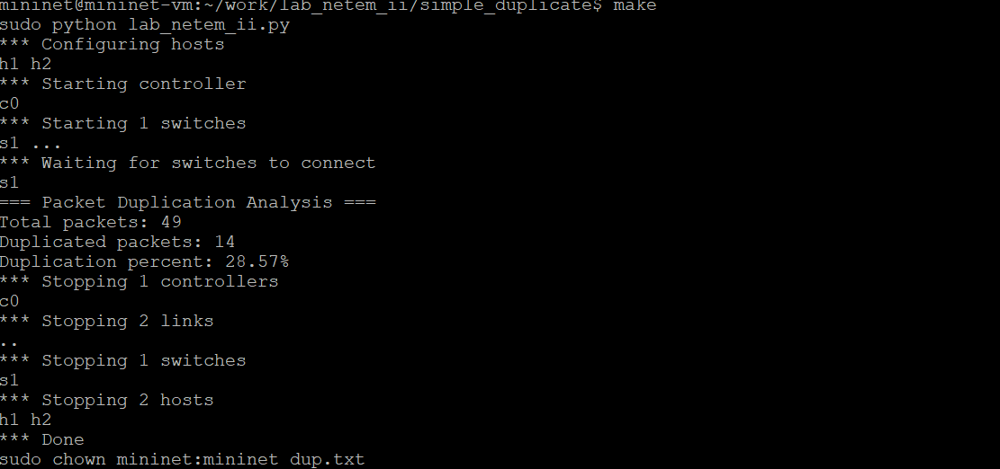{#fig:024 width=70%}

# Выводы

В результате выполнения данной лабораторной работы я получил навыки проведения интерактивных экспериментов в среде Mininet по исследованию параметров сети, связанных с потерей, дублированием, изменением порядка и повреждением пакетов при передаче данных.

# Список литературы{.unnumbered}

::: {#refs}
:::