---
## Front matter
lang: ru-RU
title: "Лабораторная работа №6"
subtitle: "Настройка пропускной способности глобальной сети с помощью Token Bucket Filter"
author:
  - Хрусталев В.Н.
institute:
  - Российский университет дружбы народов, Москва, Россия

## i18n babel
babel-lang: russian
babel-otherlangs: english

## Formatting pdf
toc: false
toc-title: Содержание
slide_level: 2
aspectratio: 169
section-titles: true
theme: metropolis
header-includes:
 - \metroset{progressbar=frametitle,sectionpage=progressbar,numbering=fraction}
---

# Информация

## Докладчик

:::::::::::::: {.columns align=center}
::: {.column width="70%"}

  * Хрусталев Влад Николаевич
  * студент
  * Российский университет дружбы народов
  * [1132222011@pfur.ru](mailto:1132222011@pfur.ru)

:::
::: {.column width="25%"}

:::
::::::::::::::

# Цель работы

Основной целью работы является знакомство с принципами работы дисциплины очереди Token Bucket Filter, которая формирует входящий/исходящий трафик для ограничения пропускной способности, а также получение навыков моделирования и исследования поведения трафика посредством проведения интерактивного и воспроизводимого экспериментов в Mininet.

# Выполнение лабораторной работы

## Настройка X-соединения

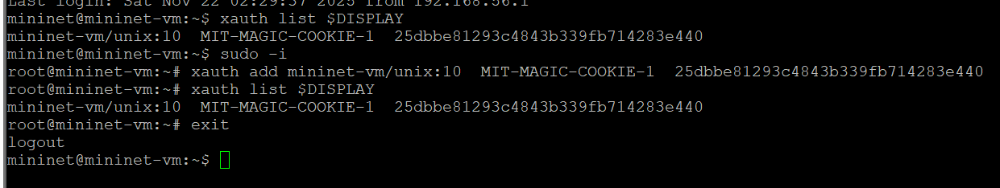{#fig:001 width=70%}

## Запуск простейшей топологии

{#fig:002 width=70%}

## Информация на хостах и коммутаторах об интерфейсах

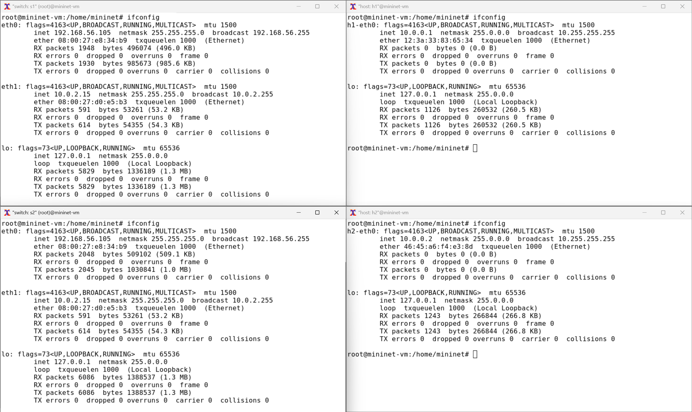{#fig:003 width=70%}

## Тестирование соединения между h1 и h2

{#fig:004 width=70%}

## Проверка изначальной пропускной способности

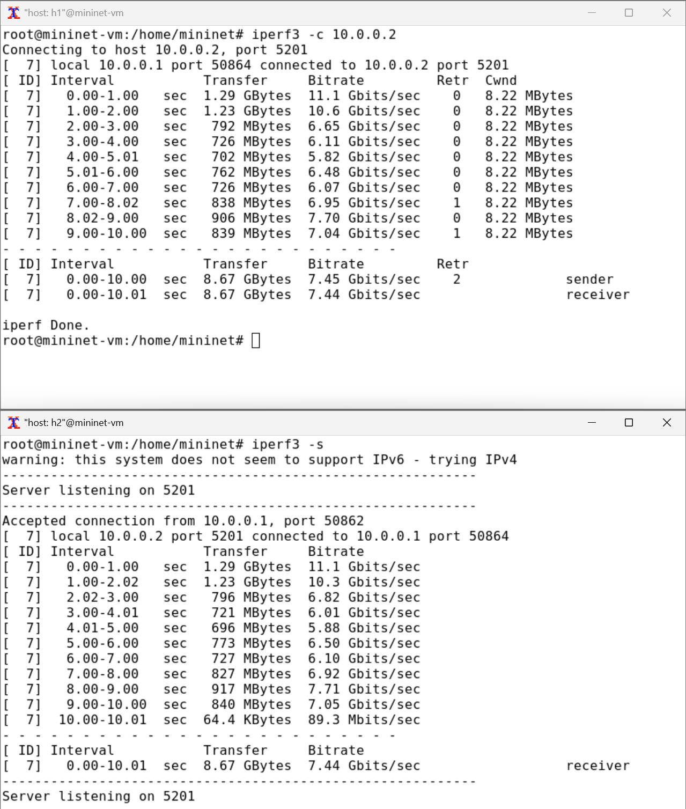{#fig:005 width=70%}

## Ограничение скорости на конечных хостах и тест

{#fig:006 width=70%}

## Ограничение скорости на коммутаторе и тест

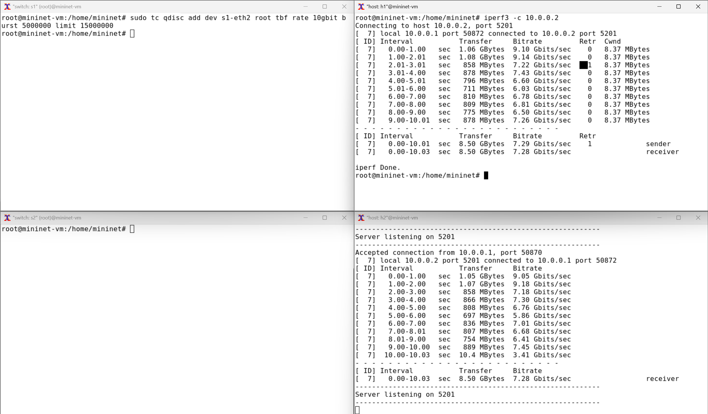{#fig:007 width=70%}

## Удаление модифицированной конфигурации на коммутаторе s1

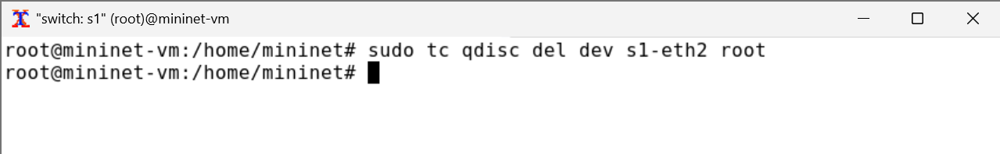{#fig:008 width=70%}

## Добавление NETEM правила задержки пакетов

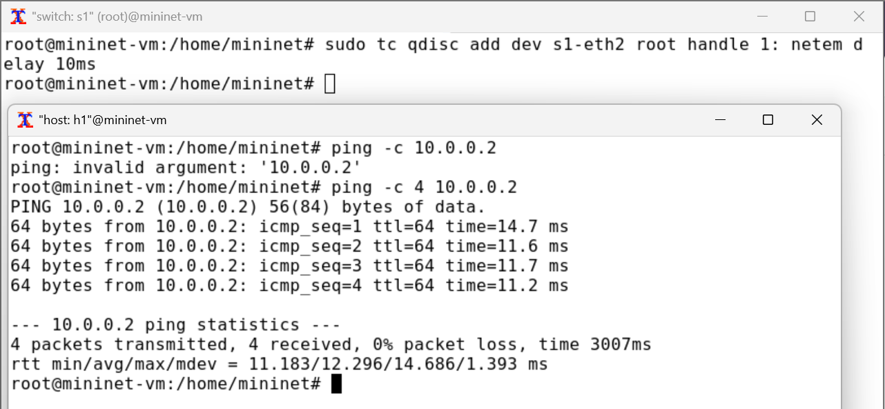{#fig:009 width=70%}

## Добавление 2-го правила ограничения скорости и тест

{#fig:010 width=70%}

## Удаление модифицированной конфигурации на коммутаторе s1

{#fig:011 width=70%}

## Создание необходимых файлов

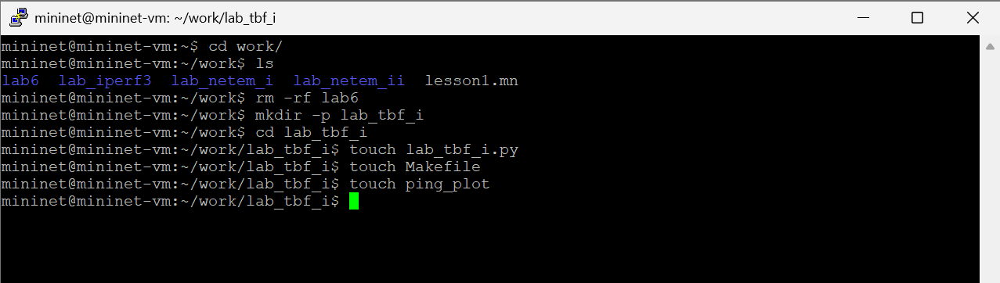{#fig:012 width=70%}

## Листинг exp1/lab_tbf_i.py

{#fig:013 width=70%}

## Листинг Makefile и ping_plot

{#fig:014 width=70%}

## Запуск exp1

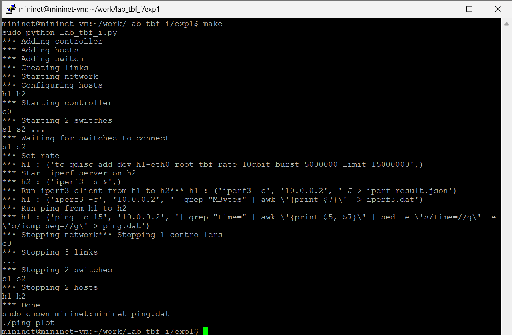{#fig:015 width=70%}

## График iperf3.png из exp1

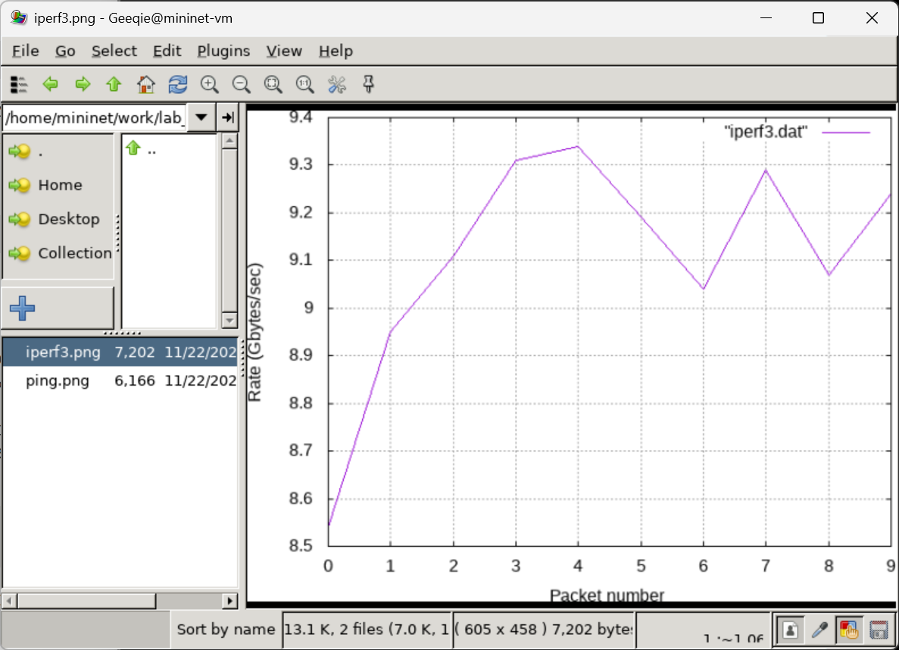{#fig:016 width=70%}

## График ping.png из exp1

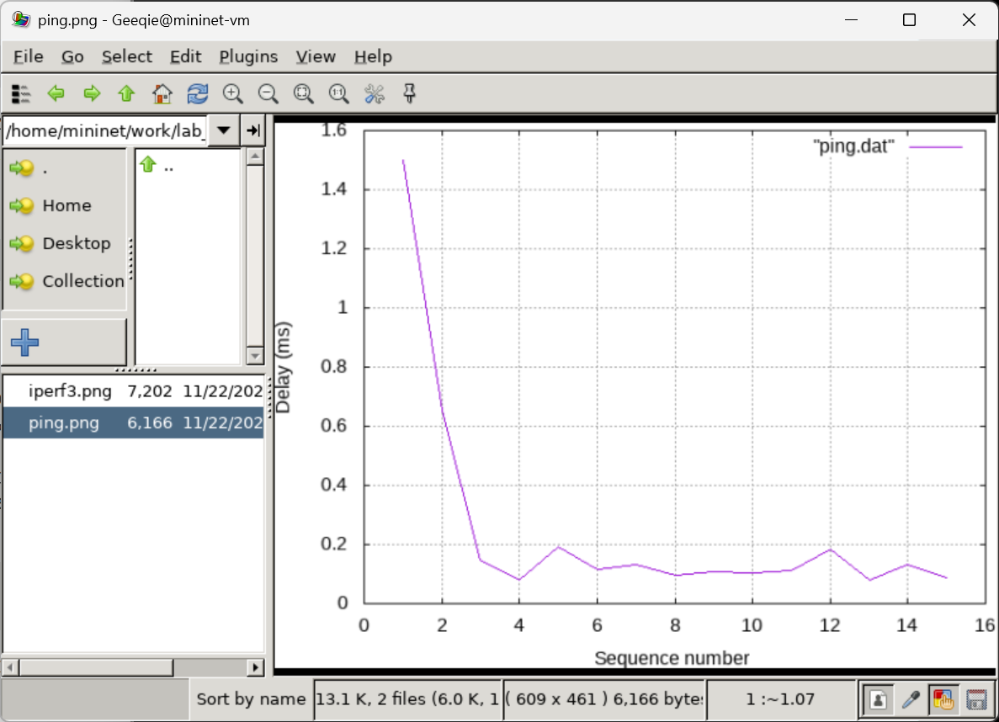{#fig:017 width=70%}

## Листинг exp2/lab_tbf_i.py

{#fig:018 width=70%}

## Запуск exp2

{#fig:019 width=70%}

## График iperf3.png из exp2

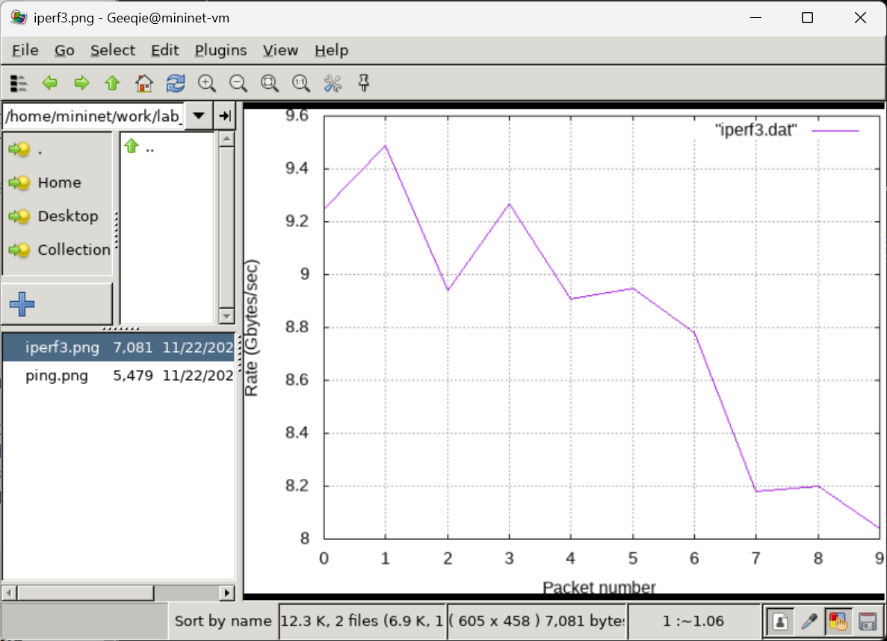{#fig:020 width=70%}

## График ping.png из exp2

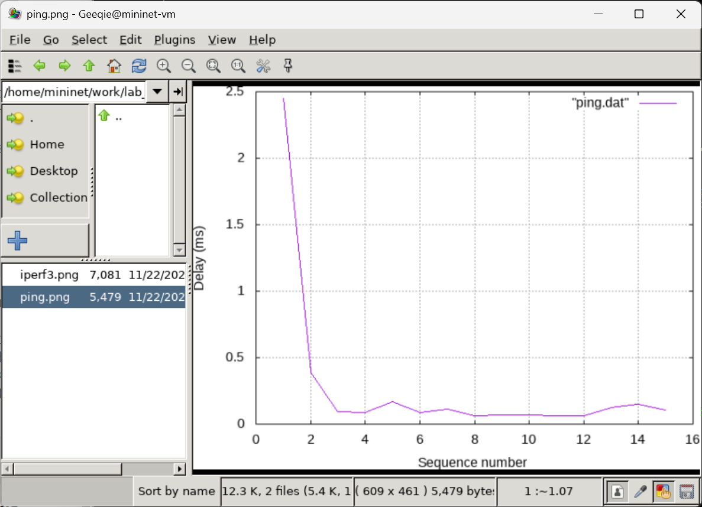{#fig:021 width=70%}

## Листинг exp3/lab_tbf_i.py

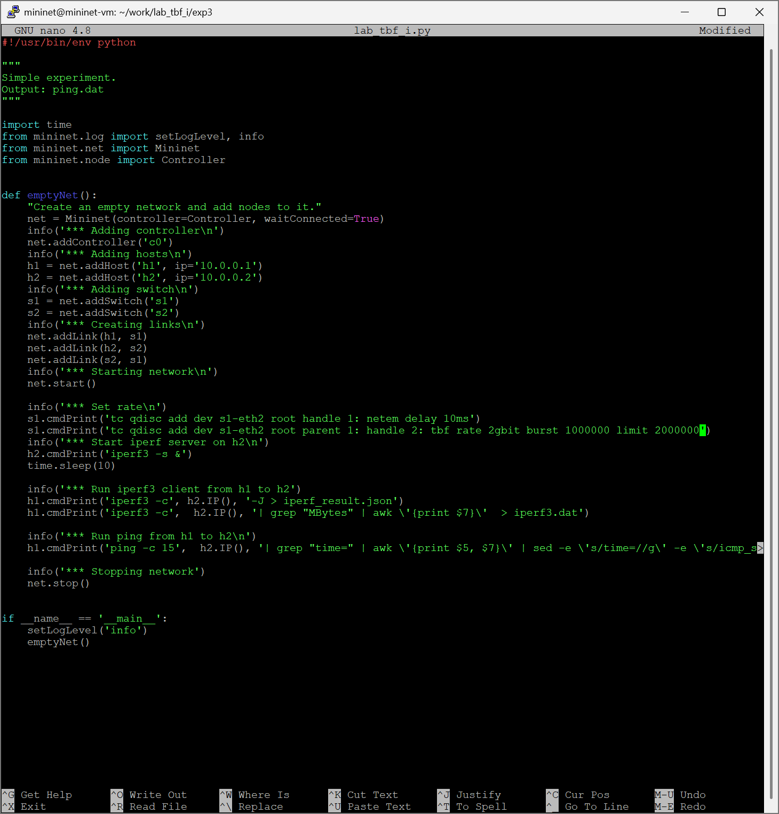{#fig:022 width=70%}

## Запуск exp3

{#fig:023 width=70%}

## График iperf3.png из exp3

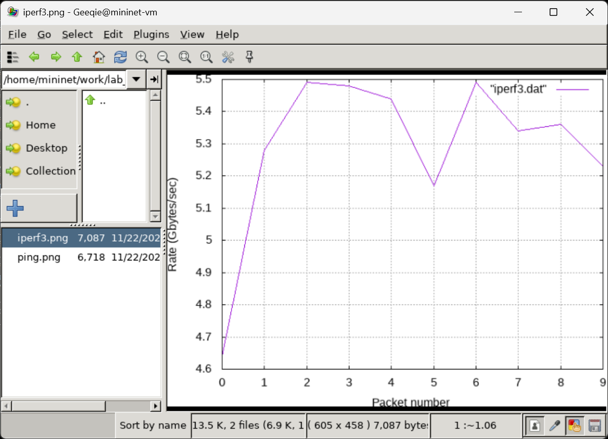{#fig:024 width=70%}

## График ping.png из exp3

{#fig:025 width=70%}

# Выводы

В результате выполнения работы я познакомился с принципами работы Token Bucket Filter, а также получили навыки моделирования и исследования поведения трафика посредством проведения интерактивного и воспроизводимого экспериментов в Mininet.

# Список литературы

1. Mininet [Электронный ресурс]. Mininet Project Contributors. URL: http://mini
net.org/ (дата обращения: 06.10.2025).

# {.standout}
