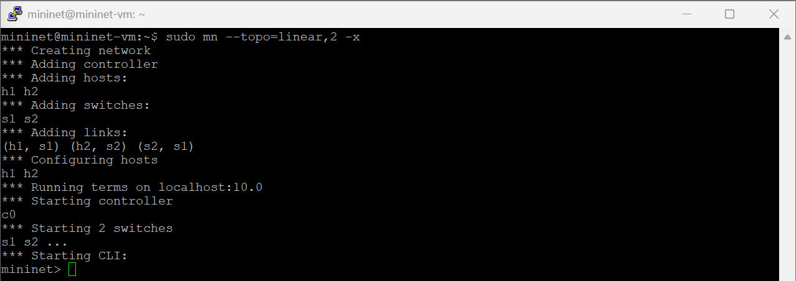
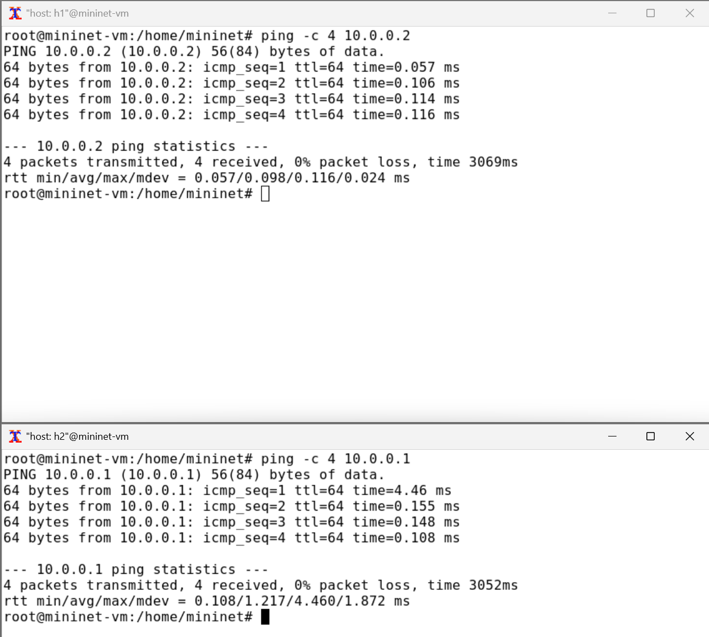
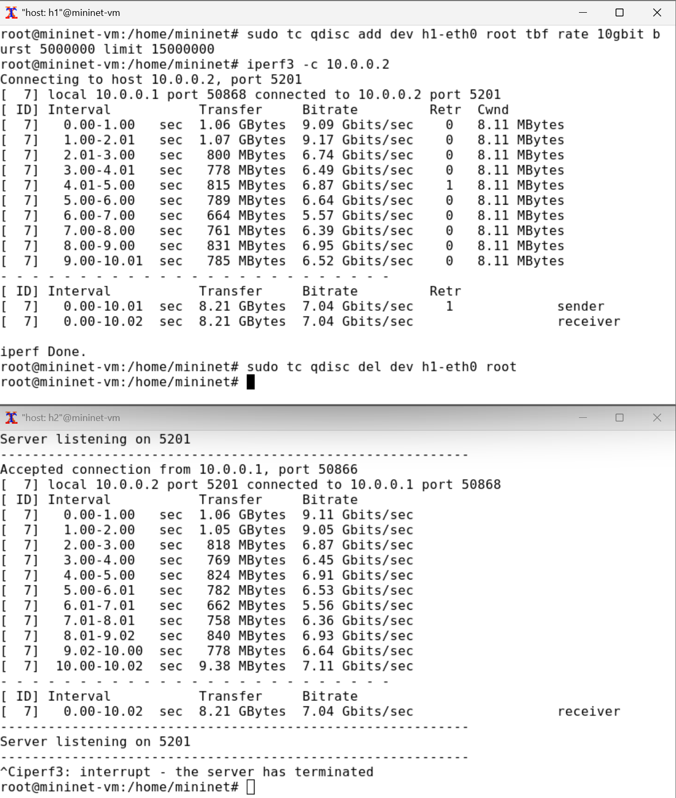
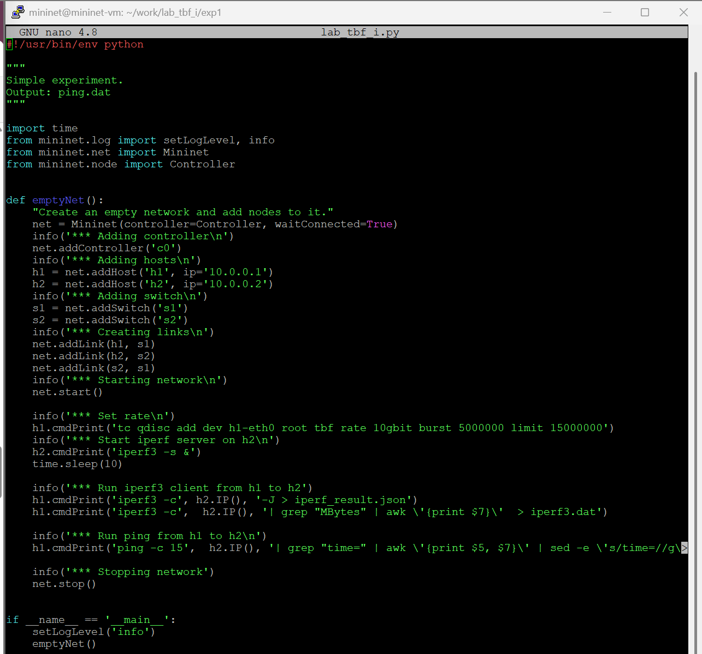
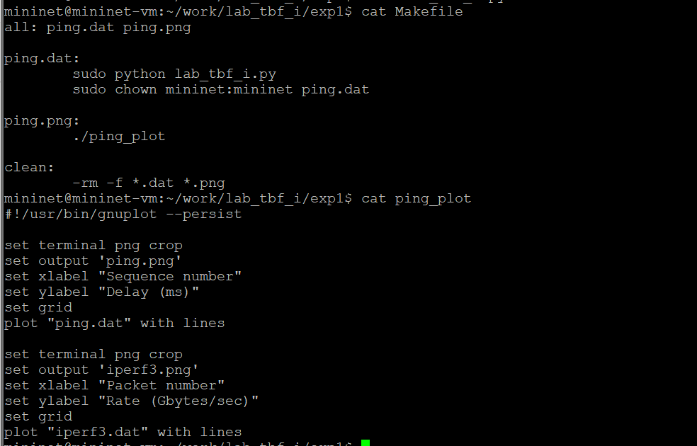
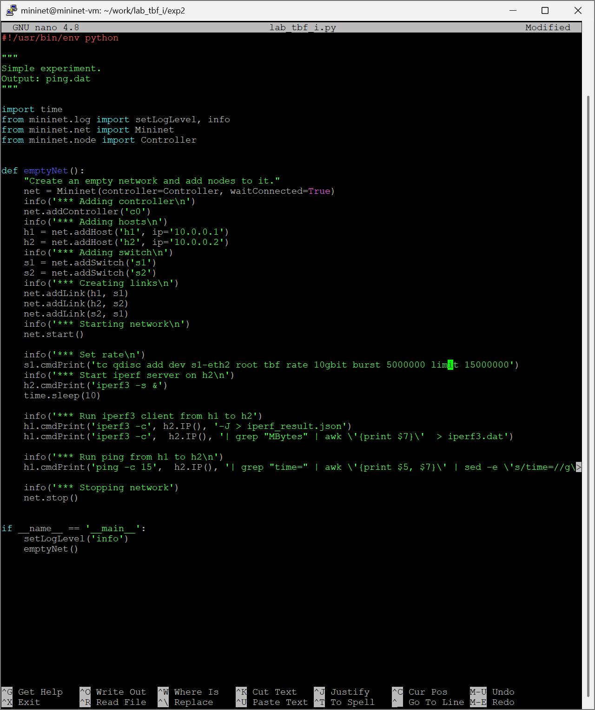
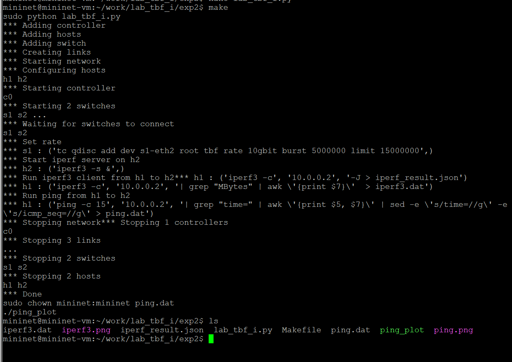
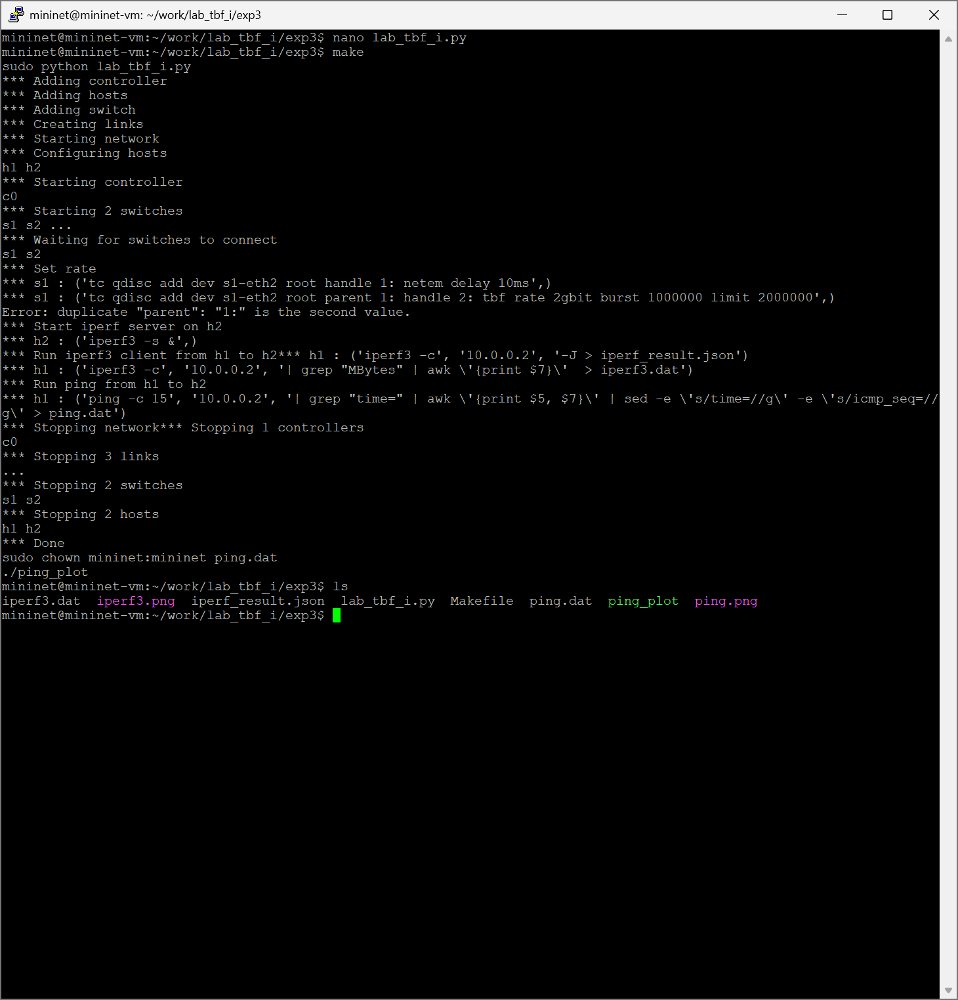
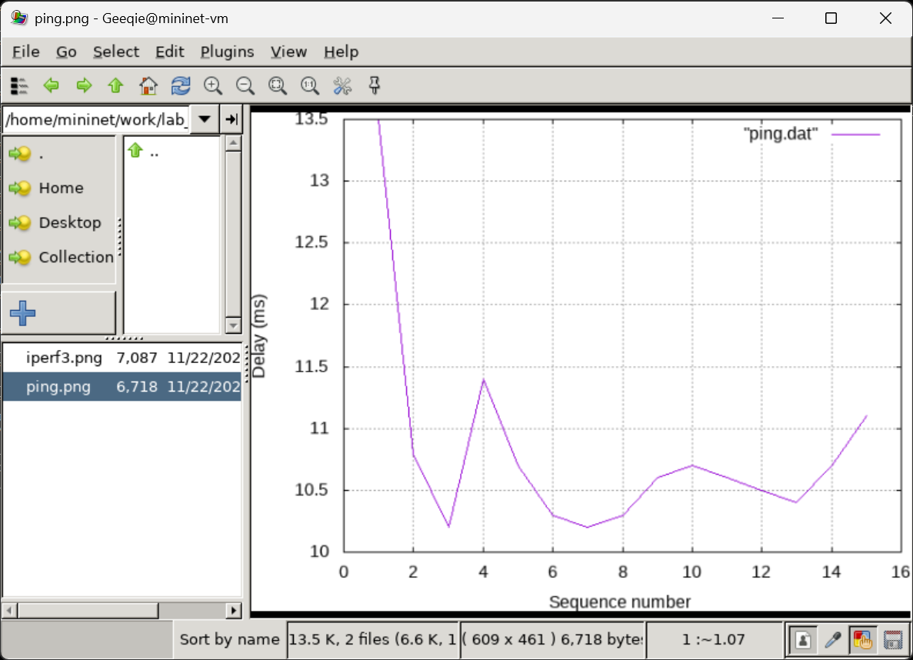

---
## Front matter
title: "Лабораторная работа №6"
subtitle: "Дисциплина: Моделирование сетей передачи данных"
author: "Хрусталев Влад Николаевич"

## Generic otions
lang: ru-RU
toc-title: "Содержание"

## Bibliography
bibliography: bib/cite.bib
csl: pandoc/csl/gost-r-7-0-5-2008-numeric.csl

## Pdf output format
toc: true # Table of contents
toc-depth: 2
lof: true # List of figures
lot: false # List of tables
fontsize: 12pt
linestretch: 1.5
papersize: a4
documentclass: scrreprt
## I18n polyglossia
polyglossia-lang:
  name: russian
  options:
	- spelling=modern
	- babelshorthands=true
polyglossia-otherlangs:
  name: english
## I18n babel
babel-lang: russian
babel-otherlangs: english
## Fonts
mainfont: PT Serif
romanfont: PT Serif
sansfont: PT Sans
monofont: PT Mono
mainfontoptions: Ligatures=TeX
romanfontoptions: Ligatures=TeX
sansfontoptions: Ligatures=TeX,Scale=MatchLowercase
monofontoptions: Scale=MatchLowercase,Scale=0.9
## Biblatex
biblatex: true
biblio-style: "gost-numeric"
biblatexoptions:
  - parentracker=true
  - backend=biber
  - hyperref=auto
  - language=auto
  - autolang=other*
  - citestyle=gost-numeric
## Pandoc-crossref LaTeX customization
figureTitle: "Рис."
tableTitle: "Таблица"
listingTitle: "Листинг"
lofTitle: "Список иллюстраций"
lotTitle: "Список таблиц"
lolTitle: "Листинги"
## Misc options
indent: true
header-includes:
  - \usepackage{indentfirst}
  - \usepackage{float} # keep figures where there are in the text
  - \floatplacement{figure}{H} # keep figures where there are in the text
---

# Цель работы

Основной целью работы является знакомство с принципами работы дисциплины очереди Token Bucket Filter, которая формирует входящий/исходящий трафик для ограничения пропускной способности, а также получение навыков моделирования и исследования поведения трафика посредством проведения интерактивного и воспроизводимого экспериментов в Mininet.


# Теоретическое введение

Mininet[@mininet] -- это эмулятор компьютерной сети. Под компьютерной сетью подразумеваются простые компьютеры — хосты, коммутаторы, а так же OpenFlow-контроллеры. С помощью простейшего синтаксиса в примитивном интерпретаторе команд можно разворачивать сети из произвольного количества хостов, коммутаторов в различных топологиях и все это в рамках одной виртуальной машины(ВМ). На всех хостах можно изменять сетевую конфигурацию, пользоваться стандартными утилитами(ifconfig, ping) и даже получать доступ к терминалу. На коммутаторы можно добавлять различные правила и маршрутизировать трафик.

# Задание

1. Задайте топологию, состоящую из двух хостов и двух коммутаторов с назначенной по умолчанию mininet сетью 10.0.0.0/8.
2. Проведите интерактивные эксперименты по ограничению пропускной способности сети с помощью TBF в эмулируемой глобальной сети.
3. Самостоятельно реализуйте воспроизводимые эксперимент по применению TBF для ограничения пропускной способности. Постройте соответствующие графики.

# Выполнение лабораторной работы

## Запуск лабораторной топологии

Запустим виртуальную машину и настроим права запуска X-соединения(рис. [-@fig:001]).

{#fig:001 width=70%}

Зададим простейшую топологию, состоящую из двух хостов и коммутатора с назначенной по умолчанию mininet сетью 10.0.0.0/8 (рис. [-@fig:002]). 

{#fig:002 width=70%}

На хостах h1 и h2 и на коммутаторах s1, s2 введем команду ifconfig, чтобы отобразить информацию, относящуюся к их сетевым интерфейсам и назначенным им IP-адресам. В дальнейшем при работе с NETEM и командой tc будут использоваться интерфейсы h1-eth0, h2-eth0 и s1-eth2  (рис. [-@fig:003])  

{#fig:003 width=70%}

Проверим подключение между хостами h1 и h2 с помощью команды ping с параметром -c 6(рис. [-@fig:004])  

{#fig:004 width=70%}

В терминале хоста h2 запустим iPerf3 в режиме сервера: `iperf3 -s`. В терминале хоста h1 запустим iPerf3 в режиме клиента: `iperf3 -c 10.0.0.2`. После завершения работы iPerf3 на хосте h1 остановите iPerf3 на хосте h2, нажав Ctrl + c. (рис. [-@fig:005]). Как видно скорости 7-11 Gbits/sec

{#fig:005 width=70%}

## Интерактивные эксперименты

### Ограничение скорости на конечных хостах

Команду tc можно применить к сетевому интерфейсу устройства для формирования исходящего трафика.Требуется ограничить скорость отправки данных с конечного хоста с помощью фильтра Token Bucket Filter (tbf).

1. Измените пропускную способность хоста h1, установив пропускную способность на 10 Гбит/с на интерфейсе h1-eth0 и параметры TBF-фильтра: `sudo tc qdisc add dev h1-eth0 root tbf rate 10gbit burst 5000000 limit 15000000`.

Здесь:
- sudo: включить выполнение команды с более высокими привилегиями
безопасности;
- tc: вызвать управление трафиком Linux;
- qdisc: изменить дисциплину очередей сетевого планировщика;
- add (добавить): создать новое правило;
- dev h1-eth0 root: интерфейс, на котором будет применяться правило;
- tbf: использовать алгоритм Token Bucket Filter;
- rate: указать скорость передачи (10 Гбит/с);
- burst: количество байтов, которое может поместиться в корзину (5000000);
- limit: размер очереди в байтах (15000000).

2. Фильтр tbf требует установки значения всплеска при ограничении скорости. Это значение должно быть достаточно высоким, чтобы обеспечить установленную скорость. Она должна быть не ниже указанной частоты, делённой на HZ, где HZ — тактовая частота, настроенная как параметр ядра, и может быть извлечена с помощью следующей команды:

```
egrep '^CONFIG_HZ_[0-9]+' /boot/config-`uname -r`
```

Для расчёта значения всплеска (burst) необходимо скорость передачи (10 Гбит/с или 10 Gbps = 10,000,000,000 bps) разделить на полученное таким образом значение HZ (на хосте h1 HZ = 250):
Burst = 10,000,000,000 / 250 = 40,000,000 bits = 40,000,000 / 8 bytes = 5,000,000 bytes.

3. C помощью Iperf3 проверим, что значение пропускной способности изменилось   

- В терминале хоста h2 запустим iPerf3 в режиме сервера: `iperf3 -s`
- В терминале хоста h2 запустим iPerf3 в режиме клиента: `iperf3 -c 10.0.0.2`
- После завершения работы iPerf3 на хосте h1 остановим iPerf3 на хосте h2, нажав Ctrl + c.

Получилась скорость передачи 7-9 Gbits/sec что соответсвует заданным ограничениям.

4. Удалим модифицированную конфигурацию на хосте h1: `sudo tc qdisc del dev h1-eth0 root` (рис. [-@fig:006])

{#fig:006 width=70%}

### Ограничение скорости на коммутаторах

При ограничении скорости на интерфейсе s1-eth2 коммутатора s1 все сеансы связи между коммутатором s1 и коммутатором s2 будут фильтроваться в соответствии с применяемыми правилами.

1. Примените правило ограничения скорости tbf с параметрами rate=10gbit, burst=5,000,000, limit=15,000,000 к интерфейсу s1-eth2 коммутатора s1, который соединяет его с коммутатором s2: `sudo tc qdisc add dev s1-eth2 root tbf rate 10gbit burst 5000000 limit 15000000`.

2. Проверьте конфигурацию с помощью инструмента iperf3 для измерения пропускной способности([рис. -@fig:007])

- В терминале хоста h2 запустите iPerf3 в режиме сервера: `iperf3 -s`
- В терминале хоста h2 запустите iPerf3 в режиме клиента: `iperf3 -c 10.0.0.2`
- После завершения работы iPerf3 на хосте h1 остановите iPerf3 на хосте h2, нажав Ctrl + c.

{#fig:007 width=70%}

Скорость передачи в пределах 6-9 Gbits/sec что соответсвует правилу.

3. Удалите модифицированную конфигурацию на коммутаторе s1: `sudo tc qdisc del dev s1-eth2 root` (рис. [-@fig:008])  

{#fig:008 width=70%}

### Объединение NETEM и TBF

NETEM используется для изменения задержки, джиттера, повреждения пакетов и т.д. TBF может использоваться для ограничения скорости. Утилита tc позволяет комбинировать несколько модулей. При этом первая дисциплина очереди (qdisc1) присоединяется к корневой метке, последующие дисциплины очереди можно прикрепить к своим родителям, указав правильную метку.

1. Объедините NETEM и TBF, введя на интерфейсе s1-eth2 коммутатора s1 задержку, джиттер, повреждение пакетов и указав скорость: `sudo tc qdisc add dev s1-eth2 root handle 1: netem delay 10ms`.

Здесь ключевое слово handle задаёт дескриптор подключения, имеющий смысл очерёдности подключения разных дисциплин qdisc.

2. Убедитесь, что соединение от хоста h1 к хосту h2 имеет заданную задержку. Для этого запустите команду ping с параметром -c 4 с терминала хоста h1 (рис. [-@fig:009])  

{#fig:009 width=70%}

Как мы видим что задержка от 10ms что вызвало наше правило

3. Добавьте второе правило на коммутаторе s1, которое задаёт ограничение скорости с помощью tbf с параметрами rate=2gbit, burst=1,000,000, limit=2,000,000: `sudo tc qdisc add dev s1-eth2 parent 1: handle 2: tbf rate 2gbit burst 1000000 limit 2000000`.

4. Проверьте конфигурацию с помощью инструмента iperf3 для измерения пропускной способности(рис. [-@fig:010])  

- В терминале хоста h2 запустите iPerf3 в режиме сервера: `iperf3 -s`
- В терминале хоста h2 запустите iPerf3 в режиме клиента: `iperf3 -c 10.0.0.2`
- После завершения работы iPerf3 на хосте h1 остановите iPerf3 на хосте h2, нажав Ctrl + c. В отчёте зафиксируйте результат работы iPerf3 на данном этапе проведения эксперимента.

{#fig:010 width=70%}

получился битрейт 0.9 - 1.9 Gbits/sec что также соответсвует заданным правиом ограничения скрости.

5. Удалите модифицированную конфигурацию на коммутаторе s1: `sudo tc qdisc del dev s1-eth2 root` (рис. [-@fig:011])  

{#fig:011 width=70%}

## Воспроизведение экспериментов

1. Для воспроизводлимого эксперемента создам каталог `~/work/lab_tbf_i`, в нём создаим файлы для воспроивзодимого эксперемента (рис. [-@fig:012]).   
2. Далее перенёс полученную структуры по папкам `~/work/lab_tbf_i/exp1`, `~/work/lab_tbf_i/exp2`, `~/work/lab_tbf_i/exp3` соответсвующим нашим эксперементам.

{#fig:012 width=70%}

Для начала воспроизведём эксперент "Ограничение скорости на конечных хоста". Создадим и заполним файл `exp1/lab_tbf_i.py`(рис. [-@fig:013]), заполним файлы `Makefile` для выполнения эксперемента и `ping_plot` для построения графиков (рис. [-@fig:014])  

{#fig:013 width=70%}

{#fig:014 width=70%}

Запустим эксперемент `exp1` командой `make`(рис. [-@fig:015])  

{#fig:015 width=70%}

Просмотрим полученные графики `iperf3.png` (рис. [-@fig:016])  и `ping.png`(рис. [-@fig:017]) 

{#fig:016 width=70%}
 
{#fig:017 width=70%}

По аналогии отредактируем файл `exp2/lab_tbf_i.py` для эксперемента " Ограничение скорости на коммутаторах"(рис. [-@fig:018]). Остальные файлы оставим такими же как в первом эксперементе. 

{#fig:018 width=70%}

Запустим эксперемент `exp2` командой `make`(рис. [-@fig:019])  

{#fig:019 width=70%}

Просмотрим полученные графики `iperf3.png` (рис. [-@fig:020])  и `ping.png`(рис. [-@fig:021]) 

{#fig:020 width=70%}

{#fig:021 width=70%}

Таким же образом проведём эксперемент "Объединение NETEM и TBF". Отредактируем `exp3/lab_tbf_i.py`(рис. [-@fig:022])  

{#fig:022 width=70%}

Запустим эксперемент `exp3` командой `make`(рис. [-@fig:023])  

{#fig:023 width=70%}

Просмотрим полученные графики `iperf3.png` (рис. [-@fig:024])  и `ping.png`(рис. [-@fig:025]) 

{#fig:024 width=70%}

{#fig:025 width=70%}

# Выводы

В результате выполнения работы я познакомился с принципами работы Token Bucket Filter, а также получили навыки моделирования и исследования поведения трафика посредством проведения интерактивного и воспроизводимого экспериментов в Mininet.

# Список литературы{.unnumbered}

::: {#refs}
:::